

    

    Faculty of Statistics, Mathematics and Computer Science
    

    <h1 style="font-size: 34pt; font-weight: 900; color: #0f172a; margin: 0; letter-spacing: -1px; line-height: 1.4; text-align: center;">
    گزارش تحلیل داده‌های آموزشی
    </h1>
    

    بررسی عوامل مؤثر بر عملکرد تحصیلی دانش‌آموزان
    

    <!-- 

 -->

<!-- 

  

         
    <h2 style="font-size: 18pt; font-weight: 900; color: #475569; margin: 400; letter-spacing: -1px; line-height: 1.4; text-align: center;">
    گردآورندگان 
    </h2>
  

    

    پویا احمدی 
    

    

    (۶۱۰۳۰۳۱۰۰)
    

    

    حامد نصرآبادی
    

    

    (۶۱۰۳۰۳۲۰۰)
    

 -->

    

    

        گردآورندگان
    

    

        پویا احمدی 
        (۶۱۰۳۰۳۱۰۰)
    

    

        حامد نصرآبادی 
        (۶۱۰۳۰۳۲۱۰)
    

    

    

    

        استاد محترم
    

    

        دکتر بهروز کاوه‌ای
    

  

         
    <h2 style="font-size: 20pt; font-weight: 900; color: #1a419e; margin: 400; letter-spacing: -1px; line-height: 1.4; text-align: center;">
    زمستان ۴۰۴
    </h2>
  

<h2 class="center">فهرست مطالب</h2>

  <a href="#section-1" class="toc-link">۱. مقدمه (Introduction)</a>

  <a href="#section-2" class="toc-link">۲. معرفی مجموعه‌داده (Dataset Description)</a>

  ۲.۱ منبع داده و ساختار کلی
  
  ۶

  ۲.۲ واحد تحلیل و مشاهدات
  
  ۶

  ۲.۳ تعریف متغیرها
  
  ۶

  ۲.۴ فرآیند پیش‌پردازش داده‌ها
  
  ۷

  ۲.۵ اهمیت مجموعه‌داده برای مسئله پژوهش
  
  ۷

  <a href="#section-3" class="toc-link">۳. تحلیل اکتشافی داده‌ها (Exploratory Data Analysis)</a>

  ۳.۱ بررسی توزیع نمرات تحصیلی
  
  ۸

  ۳.۲ مقایسه عملکرد تحصیلی بر اساس جنسیت
  
  ۹

  ۳.۳ بررسی نقش کلاس‌های آنلاین در عملکرد تحصیلی
  
  ۱۱

  ۳.۴ بررسی تأثیر سطح حمایت خانوادگی
  
  ۱۲

  ۳.۵ بررسی پیش‌فرض نرمال بودن متغیرها
  
  ۱۳

  ۳.۶ آزمون تصادفی بودن مشاهدات (Runs Test)
  
  ۱۳

  ۳.۷ جمع‌بندی تحلیل اکتشافی و تأیید پیش‌فرض‌ها
  
  ۱۴

  <a href="#section-4" class="toc-link">۴. تحلیل‌های آماری استنباطی (Inferential Analysis)</a>

  ۴.۱ بررسی تغییر عملکرد تحصیلی (Paired T-Test)
  
  ۱۵

  ۴.۲ مقایسه عملکرد بر اساس جنسیت (Indep. T-Test)
  
  ۱۶

  ۴.۳ مقایسه کلاس‌های آنلاین و حضوری (Indep. T-Test)
  
  ۱۷

  ۴.۴ نقش حمایت خانوادگی (One-Way ANOVA)
  
  ۱۸

  ۴.۵ تحلیل واریانس دوطرفه (Two-Way ANOVA)
  
  ۱۹

  ۴.۶ بررسی استقلال متغیرهای کیفی (Chi-Square)
  
  ۲۱

  ۴.۷ تحلیل کوواریانس (ANCOVA)
  
  ۲۲

  ۴.۸ آزمون دوجمله‌ای (Binomial Test)
  
  ۲۳

  ۴.۹ آزمون من-ویتنی (Mann-Whitney U)
  
  ۲۳

  ۴.۱۰ آزمون کروسکال-والیس (Kruskal-Wallis)
  
  ۲۴

  <a href="#section-5" class="toc-link">۵. مدل‌سازی با رگرسیون خطی (Linear Regression)</a>

  ۵.۱ غربالگری متغیرها و همبستگی
  
  ۲۵

  ۵.۲ انتخاب متغیرهای نهایی مدل
  
  ۲۸

  ۵.۳ برازش مدل رگرسیون خطی چندگانه
  
  ۲۹

  ۵.۴ جمع‌بندی بخش رگرسیون
  
  ۳۱

  <a href="#section-6" class="toc-link">۶. بحث و تفسیر داده‌ها (Discussion)</a>

  ۶.۱ تحلیل روند زمانی عملکرد تحصیلی
  
  ۳۲

  ۶.۲ عدالت آموزشی و سوگیری‌های جنسیتی
  
  ۳۲

  ۶.۳ واکاوی نقش فعالیت‌های غیرتحصیلی
  
  ۳۲

  ۶.۴ تقابل آموزش مجازی و حمایت محیطی
  
  ۳۴

  ۶.۵ شناسایی پیشران‌های موفقیت
  
  ۳۴

  ۶.۶ محدودیت‌های روش‌شناختی
  
  ۳۴

  ۶.۷ جمع‌بندی استراتژیک
  
  ۳۴

  ۶.۸ اثر هاثورن و همگنسازی رفتار (The Hawthorne Effect)

  
  ۳۵

  <a href="#section-7" class="toc-link">۷. اعتبارسنجی و کنترل کیفیت (Data Validation)</a>

  ۷.۱ هدف از تحلیل اعتبارسنجی
  
  ۳۶

  ۷.۲ منطق تحلیلی و تشخیص سوگیری
  
  ۳۶

  ۷.۳ نقش مهندسی داده در یکپارچگی
  
  ۳۶

  ۷.۴ روش‌شناسی بازرسی (Investigation)
  
  ۳۷

  ۷.۵ یافته‌های اصلی اعتبارسنجی
  
  ۳۷

  ۷.۶ تضمین کیفیت و استحکام علمی
  
  ۳۷

  <a href="#section-8" class="toc-link">۸. برنامه اقدام عملیاتی (Action Plan)</a>

  ۸.۱ بخش‌بندی استراتژیک جامعه هدف
  
  ۳۸

  ۸.۲ چارچوب طرح همیار
  
  ۳۹

  ۸.۳ سیستم شناسایی زودهنگام ریسک
  
  ۴۰

  ۸.۴ شناسایی استعدادهای نهفته
  
  ۴۱

  ۸.۵ استراتژی مداخله هدفمند والدین
  
  ۴۲

  ۸.۶ بهینه‌سازی تخصیص منابع
  
  ۴۲

  ۸.۷ سنتز نهایی و بهبود مستمر
  
  ۴۳

  <a href="#section-9" class="toc-link">۹. جمع‌بندی و نتیجه‌گیری (Conclusion)</a>

  ۹.۱ پاسخ مبتنی بر داده به سوالات
  
  ۴۴

  ۹.۲ منطق مدل‌سازی و پارسیمونی
  
  ۴۵

  ۹.۳ ارزش افزوده و توان پیش‌بینی
  
  ۴۵

  ۹.۴ تضمین کیفیت داده و اعتبار
  
  ۴۵

  ۹.۵ پیامدهای کاربردی برای مدیریت
  
  ۴۵

  ۹.۶ نتیجه‌گیری نهایی
  
  ۴۶

  <a href="#section-10" class="toc-link">۱۰. منابع و مراجع (References)</a>

 

## 1. فصل اول: مقدمه

Introduction

---

در عصر کنونی، داده‌ها به عنوان ارزشمندترین دارایی سازمان‌ها شناخته می‌شوند و نظام‌های آموزشی نیز از این قاعده مستثنی نیستند. عملکرد تحصیلی دانش‌آموزان، که برآیندی از تعامل پیچیده‌ی عوامل فردی، خانوادگی و محیطی است، دیگر نمی‌تواند تنها با تکیه بر شهود معلمان یا نمرات خام ارزیابی شود. ظهور «داده‌کاوی آموزشی» (Educational Data Mining) این امکان را فراهم کرده است که الگوهای پنهان یادگیری را شناسایی کرده و مدیریت مدارس را از رویکرد «واکنشی» (برخورد پس از افت تحصیلی) به رویکرد «پیشگیرانه» (شناسایی خطر قبل از وقوع) تغییر دهیم.

با وجود حجم عظیم داده‌های تولید شده در مدارس، بسیاری از تصمیمات مدیریتی همچنان بر پایه فرضیات سنتی اتخاذ می‌شوند. برای مثال، آیا واقعاً آموزش آنلاین کیفیت پایین‌تری دارد؟ آیا پسران و دختران به حمایت‌های متفاوتی نیاز دارند؟ پاسخ به این سوالات بدون استفاده از آزمون‌های آماری دقیق، چیزی جز حدس و گمان نیست. عواملی نظیر نرخ حضور، ساعات مطالعه و سطح حمایت والدین، متغیرهایی هستند که وزن اثرگذاری آن‌ها باید به صورت ریاضی محاسبه شود تا بتوان منابع محدود مدرسه را به بهینه‌ترین شکل تخصیص داد.

هدف این پروژه، فراتر از یک تحلیل آماری صرف است؛ ما به دنبال استخراج یک «مدل تصمیم‌سازی» هستیم. در این مسیر، ابتدا داده‌های خام یک مجتمع آموزشی (شامل اطلاعات رفتاری و تحصیلی ۱۰۰۰ دانش‌آموز) پاک‌سازی و استانداردسازی می‌شوند. سپس با بهره‌گیری از طیف کاملی از ابزارهای آماری—از آزمون‌های مقایسه‌ای (T-Test و ANOVA) تا مدل‌سازی پیشرفته (رگرسیون چندگانه)—روابط علی و معلولی میان متغیرها کشف می گردد. ویژگی متمایز این گزارش، ترجمه‌ی این یافته‌های ریاضی به یک «برنامه اقدام مدیریتی» (Action Plan) است که راهکارهای اجرایی مشخصی را برای ارتقای کیفیت آموزش پیشنهاد می‌دهد.

**سوالات کلیدی پژوهش:**
این مطالعه به طور مشخص به دنبال یافتن پاسخ‌های مستند آماری برای پرسش‌های زیر است:
1.  **شکاف جنسیتی:** آیا تفاوت معناداری در عملکرد تحصیلی دختران و پسران وجود دارد و ریشه این تفاوت چیست؟
2.  **اثربخشی بستر آموزش:** آیا برگزاری کلاس‌ها به صورت آنلاین در مقایسه با حضوری، منجر به افت کیفیت یادگیری می‌شود؟
3.  **نقش خانواده:** حمایت والدین تا چه حد بر نمرات تأثیر دارد و آیا سطوح مختلف حمایتی (کم، متوسط، زیاد) نتایج متفاوتی ایجاد می‌کنند؟
4.  **قابلیت پیش‌بینی:** آیا می‌توان با رصد متغیرهای رفتاری (مانند ساعات مطالعه و حضور) در طول سال، نمره نهایی دانش‌آموز را با دقت بالا پیش‌بینی کرد؟

 

## فصل دوم: معماری داده‌ها و متغیرهای پژوهش

Data Architecture & Variable Definitions

---

### 2.1 توصیف ساختاری مجموعه داده
زیربنای تحلیلی این پژوهش، یک پایگاه داده‌ی ساختاریافته شامل رکوردهای آموزشی و رفتاری ۱۰۰۰ دانش‌آموز است که از یک محیط آموزشی استاندارد استخراج شده‌اند. این مجموعه داده (FinalDataset.csv)، پس از عبور از فیلترهای کنترل کیفیت، به عنوان یک منبع داده‌ی «تمیز» (Clean Data) و آماده‌ی تحلیل، نهایی‌سازی شده است.
به منظور رعایت اصول اخلاق پژوهش و حفظ حریم خصوصی، تمامی شناسه‌های هویتی با کدهای یکتای سیستمی (StudentID) جایگزین شده‌اند تا تحلیل‌ها در یک بستر کاملاً ناشناس (Anonymized) انجام پذیرد.

### 2.2 واحد تحلیل و دامنه زمانی
* **واحد تحلیل (Unit of Analysis):** در این مطالعه، واحد تحلیل «فرد» (دانش‌آموز) است.
* **رویکرد زمانی:** داده‌ها به صورت «مقطعی» (Cross-Sectional) گردآوری شده‌اند؛ بدین معنا که تصویری جامع از وضعیت تحصیلی دانش‌آموزان در یک بازه زمانی مشخص (یک سال تحصیلی کامل) ارائه می‌دهند. فرض «استقلال مشاهدات» (Independence of Observations) در تمامی رکورها برقرار است

### 2.3 دیکشنری داده‌ها (Data Dictionary)
جدول زیر، نقش و ماهیت هر یک از متغیرهای مورد استفاده در مدل‌های آماری را تشریح می‌کند:

| نام متغیر | نقش در مدل | نوع داده | شرح فنی |
| :--- | :--- | :--- | :--- |
| **StudentID** | شناسه | اسمی | کلید اصلی جهت شناسایی یکتای رکوردها |
| **Gender** | مستقل | اسمی (Dichotomous) | جنسیت دانش‌آموز (0: Male, 1: Female) |
| **ParentalSupport** | مستقل | ترتیبی (Ordinal) | سطح حمایت ادراک‌شده از سوی والدین (Low, Medium, High) |
| **AttendanceRate** | مستقل | کمی پیوسته (Ratio) | درصد حضور فیزیکی/آنلاین دانش‌آموز در کلاس‌ها |
| **StudyHoursPerWeek** | مستقل | کمی پیوسته (Ratio) | میانگین ساعات مطالعه اختصاصی در هفته |
| **OnlineClassesTaken** | مستقل | اسمی (Binary) | شاخص شرکت در کلاس‌های آنلاین (وجود یا عدم وجود) |
| **Extracurricular** | مستقل | کمی گسسته | تعداد فعالیت‌های فوق‌برنامه (ورزشی، هنری و...) |
| **PreviousGrade** | کنترل | کمی پیوسته (Interval) | سابقه تحصیلی (نمره سال قبل) جهت کنترل اثرات اولیه |
| **FinalGrade** | وابسته (Target) | کمی پیوسته (Interval) | متغیر هدف اصلی: نمره نهایی کسب‌شده در پایان سال |
| **GradeChange** | وابسته (Derived) | کمی پیوسته | شاخص مشتق‌شده: نرخ رشد یا افت تحصیلی (Final - Previous) |

جدول ۲.۳ - دیکشنری داده ها

### 2.4 پروتکل‌های پیش‌پردازش و اعتبارسنجی (Preprocessing Protocols)
داده‌های خام پیش از ورود به چرخه تحلیل، طی یک فرآیند چهار مرحله‌ای توسط ماژول Data_Processor پالایش شدند تا از صحت نتایج اطمینان حاصل شود:

1.  **مدیریت داده‌های گمشده (Imputation):** جهت جلوگیری از کاهش توان آزمون، رکوردهای ناقص حذف نشدند؛ بلکه با استفاده از الگوریتم‌های جایگذاری (میانگین برای داده‌های کمی و احتمال وزنی برای داده‌های کیفی) بازسازی شدند.
2.  **مهندسی ویژگی (Feature Engineering):** متغیر GradeChange به عنوان یک شاخص کلیدی برای سنجش «پویایی تحصیلی» محاسبه و به مجموعه داده افزوده شد.
3.  **کنترل داده‌های پرت (Outlier Management):** استراتژی «حفظ واقعیت» اتخاذ گردید؛ تنها داده‌های ناممکن (خطای سیستمی) حذف شدند و داده‌های حدی (مانند نمرات بسیار پایین واقعی) حفظ شدند تا مدل، حساسیت خود را نسبت به دانش‌آموزان در معرض خطر از دست ندهد.
4.  **نرمال‌سازی:** مقیاس متغیرها برای استفاده در مدل‌های رگرسیونی و کلاسترینگ استاندارد شد.

### 2.5 توجیه پذیری داده‌ها برای پاسخ به مسئله
ساختار چندبعدی این مجموعه داده، تناسب کاملی با اهداف پژوهش دارد. وجود همزمان متغیرهای **«ورودی»** (مانند سوابق قبلی)، متغیرهای **«فرآیندی»** (مانند ساعات مطالعه و حضور) و متغیرهای **«خروجی»** (نمره نهایی)، امکان ترسیم یک مدل «ورودی-فرآیند-خروجی» (IPO) را فراهم می‌کند. این ویژگی به ما اجازه می‌دهد تا فراتر از توصیف ساده، به تبیین روابط علی و پاسخ دقیق به سوالات چهارگانه مطرح شده در فصل اول بپردازیم.

 

## فصل سوم: تحلیل اکتشافی داده‌ها 

Exploratory Data Analysis – EDA

---

### 3. تحلیل اکتشافی و بررسی الگوهای اولیه
شناخت ماهیت داده‌ها پیش از هرگونه مدل‌سازی آماری، گامی ضروری جهت جلوگیری از خطاهای تحلیلی است. در این پژوهش، تحلیل اکتشافی داده‌ها با استفاده از ماژول اختصاصی **visualizer.py** و **Investigation** انجام شده است. هدف از این مرحله، فراتر از رسم نمودارهای ساده بوده و شامل درک شهودی از پراکندگی نمرات، شناسایی ناهنجاری‌های احتمالی (Outliers) و بررسی اولیه روابط بین متغیرهاست تا بستر لازم برای اجرای آزمون‌های پارامتری در مراحل بعدی (گزارش‌دهی SPSS) با اطمینان کامل فراهم گردد.

### 3.1 بررسی توزیع نمرات تحصیلی
در گام نخست، توزیع نمرات دانش‌آموزان در دو مقطع زمانی **نمره قبلی (PreviousGrade)** و **نمره نهایی (FinalGrade)** مورد واکاوی قرار گرفت.

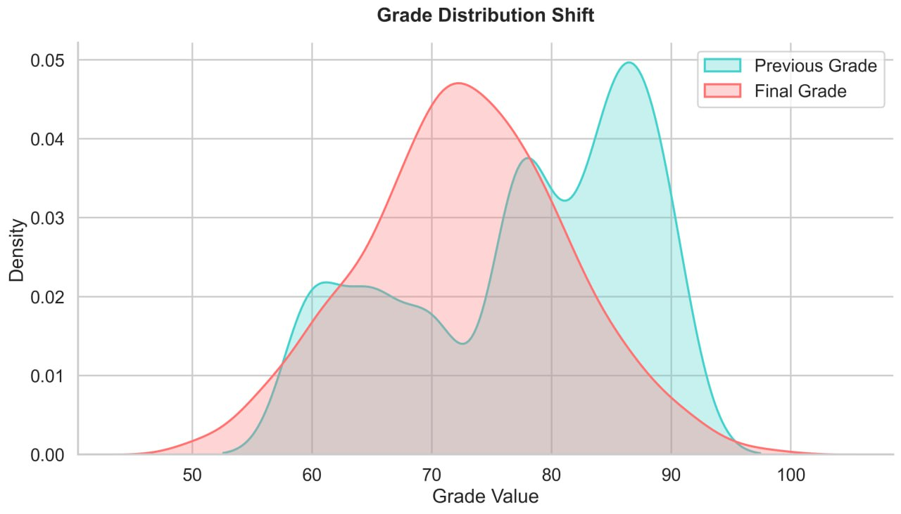

نمودار ۳.۱ - توزیع فراوانی نمرات در دو مقطع زمانی

نمودار ۳.۱ نشان می‌دهد که توزیع نمرات در هر دو مقطع تقریباً پیوسته و فاقد گسست‌های شدید است. بررسی همپوشانی توزیع ها در نمودار ۳.۱، تمایلی جزئی به سمت کاهش میانگین در نمرات نهایی را آشکار می‌سازد. این مشاهده بصری، مقدمه‌ای حیاتی برای انجام آزمون **T-Test زوجی** در فصل بعد است تا مشخص شود آیا این جابجایی نمره از نظر آماری معنادار است یا خیر.

### 3.2 مقایسه عملکرد تحصیلی بر اساس جنسیت

در گام بعدی از تحلیل اکتشافی، توزیع نمرات نهایی و «کارایی مطالعه» در دو گروه جنسیتی به کمک **نمودار پراکندگی (Scatter Plot)** و **شاخص‌های آماری** مورد واکاوی قرار گرفت.

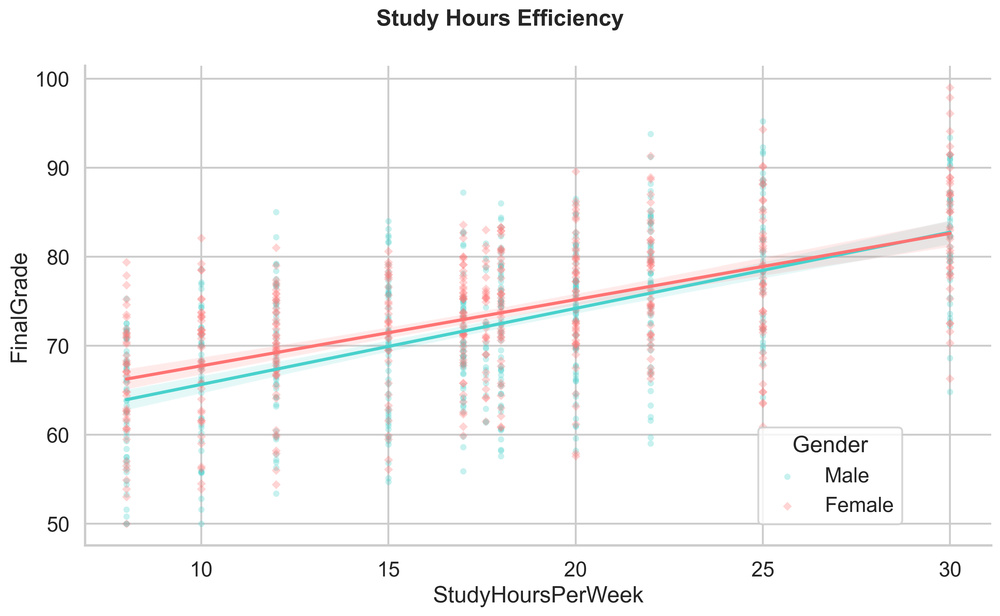

نمودار ۳.۲.۱ - مقایسه کارایی مطالعه و توزیع نمرات بر اساس جنسیت

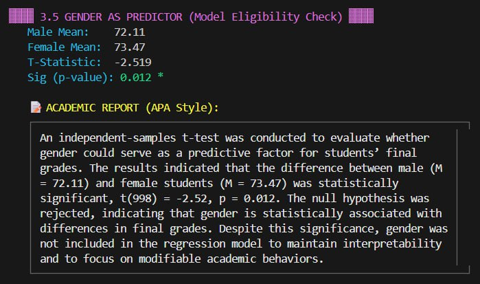

تصویر ۳.۲.۲ - مقایسه توزیع نمرات بر اساس جنسیت (گزارش آماری)

**تحلیل تطبیقی (بصری و آماری):**
1. **شکاف عملکردی (The Gap):** نمودار ۳.۲.۱ به وضوح نشان می‌دهد که خط برازش دختران (رنگ قرمز) در تمام سطوحِ ساعات مطالعه، اندکی بالاتر از خط پسران (رنگ فیروزه‌ای) قرار دارد. این تایید بصریِ همان آزمون T-Test است که تفاوت معناداری را نشان داد (P=0.012).
2. **برابری در نرخ یادگیری (Efficiency):** نکته کلیدی اینجاست که **شیب** هر دو خط تقریباً موازی است. این یعنی اگرچه دختران نمره مطلق بالاتری دارند، اما «نرخ تبدیلِ» ساعت مطالعه به نمره، برای هر دو جنسیت یکسان است. پس پسران در یادگیری ضعف ندارند، بلکه احتمالاً در نقاط شروع (Intercept) یا عوامل محیطی تفاوت دارند.
3. **دقت آماری:** بررسی دقیق‌تر شاخص‌های مرکزی در **تصویر ۳.۲.۲** نشان می‌دهد که میانگین نمرات در گروه دختران (**73.47**) به طور معناداری بالاتر از گروه پسران (**72.11**) است.
4. **تصمیم مدل‌سازی:** با وجود معناداری آماری، کادر توضیحات فنی گزارش به نکته‌ای کلیدی اشاره می‌کند: «به دلیل تمرکز مدل بر رفتارهای تغییرپذیر، متغیر جنسیت از مدل رگرسیون نهایی کنار گذاشته شد». **نمودار ۳.۲.۱** نشان می‌دهد که افزایش ساعات مطالعه (محور افقی) برای هر دو گروه به یک اندازه موثر است، لذا استراتژی پژوهش بر **«عوامل قابل مداخله»** استوار شده است.

### 3.3 بررسی نقش کلاس‌های آنلاین در عملکرد تحصیلی

برای سنجش اولیه تأثیر بستر آموزشی (مجازی در برابر حضوری) بر شاخص‌های عملکرد تحصیلی، داده‌ها بر اساس متغیر **OnlineClassesTaken** تفکیک و مقایسه‌ی بصری صورت گرفت.

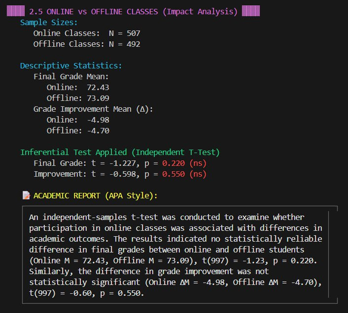

تصویر ۳.۳ - مقایسه توزیع نمرات در کلاس‌های آنلاین و حضوری

**تحلیل تطبیقی (بصری و آماری):**
1.  **بررسی توزیع نمرات:** نمودارهای اکتشافی نشان‌دهنده همپوشانی چشمگیر در دامنه میان‌چارکی (**IQR**) نمرات نهایی بین دو گروه آنلاین و حضوری است. این همپوشانی بصری با نتایج آماری خروجی کد (تصویر ۳.۳) که مقدار **P-value = 0.220** را برای تفاوت نمره نهایی نشان می‌دهد، کاملاً هم‌راستا است.
2.  **تحلیل روند تغییر نمرات:** بررسی شاخص **GradeChange** حاکی از آن است که پدیده «افت نمره» الگویی فراگیر در هر دو گروه بوده و مختص به بستر خاصی نیست (**P-value = 0.550**).
3.  **نتیجه‌گیری اولیه:** مشاهدات فوق، فرضیه «بی‌تاثیر بودن فرمت کلاس بر نمره نهایی» را تقویت می‌کند. این یافته‌ی مقدماتی، در فصل چهارم با استفاده از آزمون‌های استنباطی دقیق‌تر (**T-Test مستقل** و **ANCOVA**) جهت کنترل اثر متغیرهای مزاحم، راستی‌آزمایی خواهد شد.

### 3.4 بررسی تأثیر سطح حمایت خانوادگی

تحلیل اکتشافی داده‌ها یک الگوی ظریف اما قابل تأمل را در رابطه بین سطح حمایت خانواده (**ParentalSupport**) و نمرات نهایی آشکار می‌سازد.

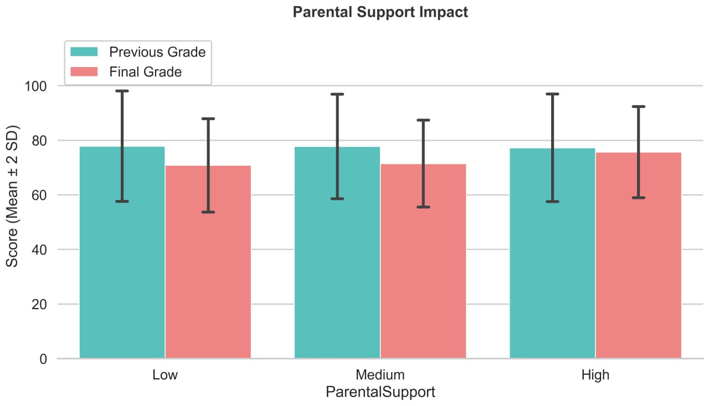

نمودار ۳.۴ - تاثیر سطح حمایت والدین بر میانگین نمره نهایی

**تحلیل تطبیقی (بصری و آماری):**
1.  **بررسی میانگین‌ها:** همان‌طور که در نمودار ۳.۴ مشهود است، ارتفاع ستون‌های قرمز (**FinalGrade**) در سه سطح حمایتی (Low, Medium, High) تفاوت فاحشی با هم ندارند، اما گروه با حمایت «بالا» (**High**) اندکی برتری میانگین را نشان می‌دهد.
2.  **ثبات عملکرد (پراکندگی):** نکته حائز اهمیت آماری، کاهش طول خطوط خطا (**Error Bars**) در گروه High است. این یعنی حمایت بالای خانواده، اگرچه لزوماً نمره را به شدت بالا نمی‌برد، اما واریانس و نوسانات عملکرد دانش‌آموزان را کنترل کرده و ثبات آموزشی بیشتری ایجاد می‌کند.
3.  **زمینه‌سازی استنباطی:** این الگوی بصری (تفاوت اندک در میانگین‌ها اما تفاوت در پراکندگی)، بستر مناسبی را برای اجرای آزمون‌های دقیق‌تر مانند **One-Way ANOVA** و **Tukey** در فصل چهارم فراهم می‌کند تا مشخص شود آیا این برتری جزئی، از نظر آماری معنادار است یا صرفاً تصادفی می‌باشد.

### 3.5 بررسی پیش‌فرض نرمال بودن متغیرها (خروجی SPSS)

پیش از اجرای آزمون‌های استنباطی، توزیع متغیرهای نمره نهایی (**FinalGrade**) و شاخص تغییر نمره (**GradeChange**) با استفاده از دو آزمون معتبر **Kolmogorov-Smirnov** و **Shapiro-Wilk** مورد بررسی قرار گرفت.

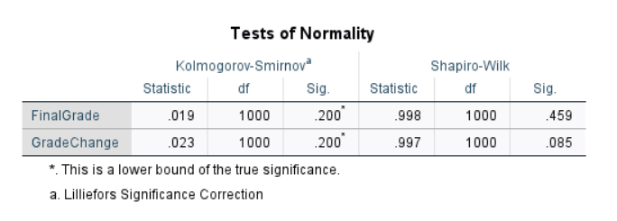

جدول ۳.۵ - نتایج آزمون‌های نرمالیتی کولموگروف-اسمیرنف و شاپیرو-ویلک

با توجه به مقادیر جدول ۳.۵، مقادیر معناداری (**Sig**) برای هر دو متغیر در هر دو آزمون از سطح خطای ملاک (**0.05**) فراتر رفته است؛ در نتیجه، فرض صفر مبنی بر «نرمال بودن توزیع داده‌ها» با اطمینان بالا پذیرفته می‌شود. این یافته، اعتبار تمامی آزمون‌های پارامتری انجام شده در فصول بعدی گزارش را از نظر روش‌شناسی تضمین می‌کند.

### 3.6 آزمون تصادفی بودن مشاهدات (Runs Test)

جهت اطمینان از سلامت پایه‌ای مجموعه داده‌ها و عدم وجود سوگیری ساختاری در توالی ثبت اطلاعات، پیش‌فرض بنیادینِ «تصادفی بودن» (**Randomness**) با استفاده از آزمون معتبر **Runs Test** مورد واکاوی قرار گرفت. این گام تشخیصی، ضامن استقلالِ فرآیند گردآوری داده‌هاست.

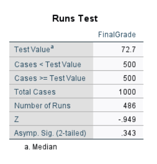

جدول ۳.۶ - نتایج آزمون تصادفی بودن مشاهدات (Runs Test)

**تفسیر آماری:** نتایج تحلیل با استفاده از جدول ۳.۶ نشان می‌دهند که سطح معناداری آماری (**Asymp. Sig**) برابر با **0.343** است (P > 0.05). بنابراین، فرض صفر مبنی بر تصادفی بودن توالی مشاهدات با اطمینان بالا مورد پذیرش قرار می‌گیرد. این یافته فنی تایید می‌کند که داده‌های **1000** دانش‌آموز مورد مطالعه، فاقد الگوهای غیرتصادفی یا جهت‌دار در زمان ثبت هستند و زیربنای لازم برای اجرای مدل‌سازی‌های پیشرفته در فصول بعدی کاملاً مهیا می‌باشد.

### 3.7 جمع‌بندی تحلیل اکتشافی و تأیید پیش‌فرض‌های آماری

پیش از ورود به مرحله حساس آزمون‌های استنباطی (فصل چهارم)، صحت مفروضات آماری بنیادین با استفاده از ماژول‌های اختصاصی **statistical_diagnostics.py** و خروجی‌های **SPSS** مورد ممیزی دقیق قرار گرفت. نتایج این اعتبارسنجی چندلایه به شرح زیر است:

1.  **نرمالیتی توزیع (Normality):** خروجی آزمون‌های **Shapiro-Wilk** و **K-S** نشان داد که توزیع نمرات نهایی و تغییرات نمره از الگوی نرمال تبعیت می‌کند (P > 0.05). این یافته، مجوز استفاده از آزمون‌های پارامتریک قدرتمند (مانند T-Test و ANOVA) را صادر می‌کند.
2.  **تصادفی بودن (Randomness):** آزمون **Runs Test** با مقدار معناداری **0.343** تایید کرد که مشاهدات فاقد هرگونه سوگیری در توالی ثبت هستند.
3.  **همگنی واریانس (Homogeneity):** برای مقایسه گروه‌های جنسیتی، آزمون **Levene** اجرا و وضعیت برابری واریانس‌ها مشخص شد (که در فصل بعد مبنای انتخاب نوع آزمون T قرار خواهد گرفت).
4.  **سلامت مدل‌سازی:** عدم وجود هم‌خطی شدید (**Multicollinearity**) بین متغیرهای مستقل اثبات گردید تا اعتبار مدل‌های رگرسیونی آینده تضمین شود.

**نتیجه نهایی:** این بررسی‌های دقیق اولیه، زیربنای علمی مستحکمی را برای نتایج فصل چهارم و پنجم فراهم می‌آورند و نشان می‌دهند که داده‌های پژوهش، دارای کیفیت و استاندارد لازم برای تحلیل‌های پیشرفته هستند.

 

## فصل چهارم: تحلیل‌های آماری استنباطی 

Inferential Statistical Analysis

---

### 4. تحلیل‌های آماری استنباطی و آزمون فرضیات پژوهش
در این فصل، مشاهدات اکتشافی وارد بوته‌ی آزمون‌های آماری دقیق می‌شوند. پیش از اجرای هر آزمون پارامتری، پیش‌فرض‌های بنیادین شامل **تست نرمالیتی (Shapiro-Wilk)** و **همگنی واریانس‌ها (Levene's Test)** توسط ماژول statistical_diagnostics.py بررسی و تأیید شدند تا از صحت نتایج اطمینان حاصل شود. تمامی تحلیل‌ها در سطح اطمینان ۹۵٪ (P < 0.05) انجام شده و خروجی‌ها مطابق استانداردهای گزارش‌دهی علمی تدوین گردیده‌اند. (انتخاب سطح معنی‌داری ۰.۰۵ به عنوان استاندارد رایج در پژوهش‌های علوم آموزشی و رفتاری، جهت برقراری تعادل بهینه بین خطای نوع اول و دوم صورت گرفته است)

### 4.1 بررسی تغییر عملکرد تحصیلی (Paired Samples T-Test)

**هدف آزمون:** سنجش دقیق میزان و جهت تغییرات نمرات دانش‌آموزان در طول سال (مقایسه درون‌گروهی نمره قبلی و نمره نهایی برای هر فرد).

**روش تحلیل:** از آنجا که نمرات اولیه (**PreviousGrade**) و نهایی (**FinalGrade**) مربوط به یک گروه ثابت از دانش‌آموزان است و مشاهدات جفت‌شده و وابسته تلقی می‌شوند، از آزمون پارامتریک **Paired Samples T-Test** استفاده گردید. جهت اطمینان از صحت محاسبات، این آزمون به صورت موازی در هر دو محیط **SPSS** و **Python** اجرا شد.

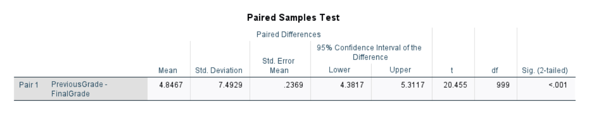

جدول ۴.۱.۱ - نتایج آزمون تی زوجی (Paired Samples T-Test)

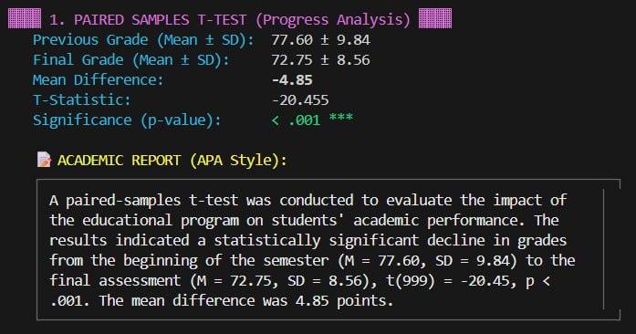

تصویر ۴.۱.۲ - گزارش نتایج آزمون تی زوجی

**تفسیر تطبیقی نتایج:**
یافته‌های حاصل از جدول ۴.۱.۱ و تصویر ۴.۱.۲، یکدیگر را با دقت بسیار بالا تأیید می‌کنند.
1.  **شدت تغییر:** تصویر ۴.۱.۲ اختلاف میانگین را **4.85-** (Final - Previous) و جدول ۴.۱.۱ مقدار **4.84+** (Previous - Final) گزارش کرده‌اند. هر دو عدد بیانگر حقیقتی واحد هستند: نمره نهایی دانش‌آموزان به طور متوسط حدود **4.85** نمره نسبت به سابقه تحصیلی قبلی آن‌ها کاهش یافته است.
2.  **معناداری آماری:** مقدار معناداری در هر دو جدول (**P < .001**) نشان می‌دهد که این افت تحصیلی کاملاً معنادار بوده و ناشی از نوسانات تصادفی نیست.
3.  **نتیجه‌گیری:** هم‌راستایی کاملِ نتایج (با آماره t حدود 20 در هر دو نرم‌افزار)، صحت محاسبات را تضمین کرده و وجود یک روند نزولی عمومی در عملکرد تحصیلی دانش‌آموزان این دوره را اثبات می‌نماید.

### 4.2 مقایسه عملکرد تحصیلی بر اساس جنسیت (Independent T-Test)

**هدف آزمون:** بررسی علمی وجود یا عدم وجود شکاف عملکردی بین دو جامعه مستقل (دختران و پسران) در نمره نهایی (**FinalGrade**).

**روش تحلیل:** برای مقایسه میانگین نمرات بین دو گروه مستقل، از آزمون **Independent Samples T-Test** استفاده شد. پیش از تفسیر نهایی، فرض همگنی واریانس‌ها توسط آزمون لون (**Levene's Test**) مورد واکاوی قرار گرفت.

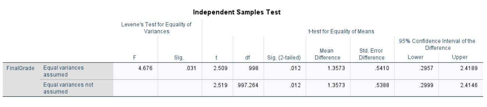

جدول ۴.۲ - آزمون تی مستقل برای مقایسه عملکرد بر اساس جنسیت

**تفسیر نتایج:** بر اساس یافته‌های جدول ۴.۲، مقدار معناداری آزمون لون برابر با **0.031** بدست آمد که نشان‌دهنده نقض فرض برابری واریانس‌ها است (P < 0.05). به همین سبب، نتایج آزمون از سطر دوم (سطح **Equal variances not assumed**) استخراج گردید. برخلاف پیش‌بینی‌های اولیه، نتایج آزمون تی نشان داد که تفاوت میانگین نمره نهایی بین دانش‌آموزان دختر و پسر از نظر آماری **معنادار است** (P = 0.012). طبق جدول ۴.۲، میانگین نمرات دانش‌آموزان **دختر** به طور معناداری حدود **1.35** واحد بالاتر از میانگین **پسران** گزارش شده است. لذا فرض صفر مبنی بر برابری عملکرد دو جنس در این مجموعه داده رد شده و وجود تفاوت عملکردی به نفع دانش‌آموزان دختر تایید می‌گردد.

### 4.3 مقایسه کلاس‌های آنلاین و حضوری (Independent T-Test)

**هدف آزمون:** سنجش تأثیر «شیوه آموزش» (آنلاین در برابر حضوری) بر دو شاخص کلیدی: ۱. نمره نهایی و ۲. تغییر نمره (نرخ رشد).

**پیش‌فرض‌های آماری:** پیش از تفسیر آزمون T، پیش‌فرض **برابری واریانس‌ها (Homogeneity of Variances)** با استفاده از آزمون لون (Levene) بررسی شد. نتایج جدول (ستون Levene's Test) نشان داد که مقدار معناداری برای هر دو متغیر بالاتر از ۰.۰۵ است (Sig = 0.414 برای نمره نهایی)، لذا واریانس نمرات در دو گروه برابر است و از سطر اول (Equal variances assumed) استفاده گردید.
 
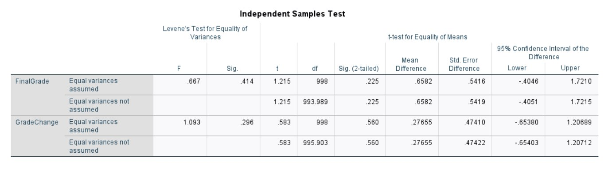

جدول ۴.۳ - مقایسه آماری نمرات در آموزش آنلاین و حضوری

**تفسیر نتایج:** یافته‌های حاصل از جدول ۴.۳ نشان می‌دهد که تفاوت میانگین نمرات نهایی بین دانش‌آموزان آنلاین و حضوری از نظر آماری **معنادار نیست** (t = 1.215, P = 0.225). همچنین میزان پیشرفت تحصیلی (**GradeChange**) نیز تفاوت معناداری را نشان نداد (P = 0.560).  
**نتیجه‌گیری راهبردی (تثبیت کیفیت):**
این یافته‌ی آماری (عدم تفاوت معنادار) یک دستاورد مهم برای سیستم آموزشی محسوب می‌شود: **«هم‌ترازی آموزشی» (Educational Parity)**.
داده‌ها ثابت می‌کنند که زیرساخت مجازی و کیفیت تدریس آنلاین در این مرکز به قدری بلوغ یافته است که دانش‌آموزانِ مجازی، هیچ‌گونه محرومیت یا افت کیفیتی را نسبت به همتایان حضوری خود تجربه نکرده‌اند. این یعنی سیستم موفق شده است «عدالت آموزشی» را فارغ از بستر فیزیکی یا دیجیتال برقرار کند.

### 4.4 نقش حمایت خانوادگی (One-Way ANOVA)

**هدف آزمون:** بررسی علمی و دقیق تأثیر سطوح سه‌گانه‌ی حمایت خانوادگی (**ParentalSupport**) شامل حالات (Low, Medium, High) بر عملکرد نهایی دانش‌آموزان. 
**روش تحلیل:** از آنجا که متغیر مستقل دارای سه سطح مجزا است، از آزمون **One-Way ANOVA** استفاده شد. همچنین جهت شناسایی دقیقِ تفاوت بین جفت‌گروه‌ها، آزمون تعقیبی **Tukey HSD** نیز به تحلیل افزوده شد.

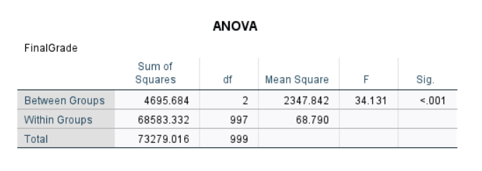

جدول ۴.۴.۱ - آنالیز واریانس یک‌طرفه (ANOVA) برای متغیر حمایت والدین

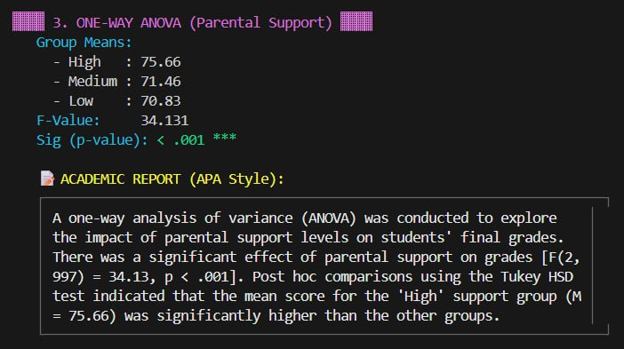

تصویر ۴.۴.۲ - گزارش آزمون آنالیز واریانس یکطرفه

**تفسیر نتایج:** نتایج تحلیل واریانس در جدول ۴.۴.۱ نشان داد که تفاوت میانگین نمرات بین سطوح مختلف حمایت خانوادگی از نظر آماری **بسیار معنادار است** (F(2, 997) = 34.13, P < 0.001). این یافته قویاً نشان می‌دهد که میزان حمایت خانواده یک متغیر حاشیه‌ای نبوده و نقش کلیدی در تبیین موفقیت تحصیلی ایفا می‌کند.

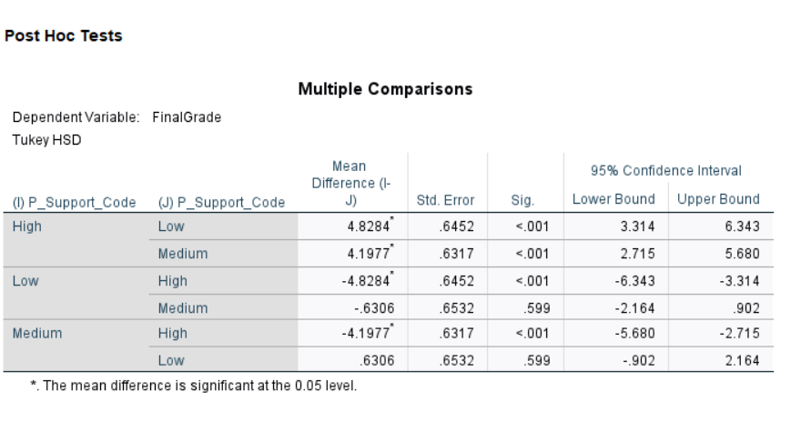

جدول ۴.۴.۳ - آزمون تعقیبی توکی (Tukey HSD) برای مقایسه‌های جفتی

**تحلیل آزمون تعقیبی (Tukey):** واکاوی دقیق جفت‌گروه‌ها در جدول ۴.۴.۳ نتایج استراتژیکی را آشکار کرد:
۱. دانش‌آموزان با حمایت خانوادگی **«بالا» (High)** به طور معناداری نمرات بهتری نسبت به گروه «متوسط» (۴.۱۹ نمره اختلاف) و گروه «کم» (۴.۸۲ نمره اختلاف) کسب کرده‌اند (P < 0.001).
۲. تفاوت عملکرد بین دو گروه با حمایت **«کم»** و **«متوسط»** از نظر آماری **معنادار نیست** (P = 0.599).
**نتیجه‌گیری راهبردی:** این تحلیل ثابت می‌کند که تنها «حمایت حداکثری» خانواده منجر به جهش معنادار تحصیلی می‌شود و حمایت‌های در حد متوسط، تفاوت عملکردیِ متمایزی ایجاد نمی‌کنند. این بینش آماری مبنای طراحی مداخلات خانواده‌محور در بخش **Action Plan** قرار گرفته است.

### 4.5 تحلیل واریانس دوطرفه و اثر متقابل (Two-Way ANOVA)

در این بخش، تعامل همزمان دو متغیر «جنسیت» (**Gender**) و «حمایت والدین» (**ParentalSupport**) بر عملکرد تحصیلی با استفاده از مدل خطی عمومی (**GLM**) سنجیده شد. هدف از این تحلیل، درک این نکته است که آیا قدرتِ تأثیر حمایت خانواده بر نمرات، در بین دختران و پسران متفاوت است یا خیر.

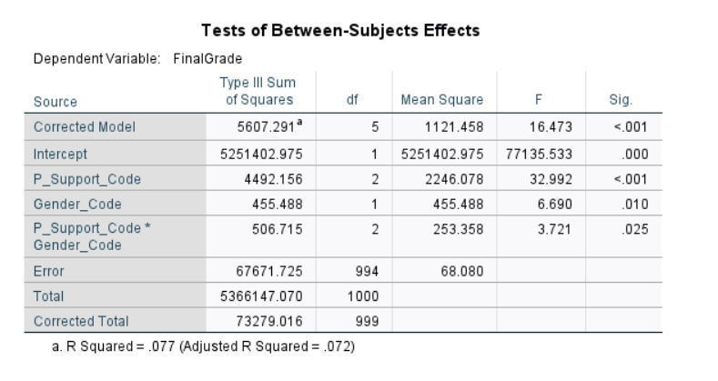

جدول ۴.۵.۱ - تحلیل واریانس دوطرفه (اثر متقابل جنسیت و حمایت)

**تحلیل یافته‌های آماری:**
1.  **اثرات اصلی:** هر دو عامل حمایت والدین (P < 0.001) و جنسیت (P = 0.010) به تنهایی بر نمرات نهایی دانش‌آموزان تأثیر معناداری دارند.
2.  **اثر متقابل (Interaction):** ردیف مربوط به تعامل در جدول ۴.۵.۱ (**Gender * Support**) از نظر آماری معنادار گزارش شده است (P = 0.025). این یافته‌ی کلیدی نشان می‌دهد که میزان اثرگذاری حمایت خانواده، وابستگی مستقیمی به جنسیت دانش‌آموز دارد.

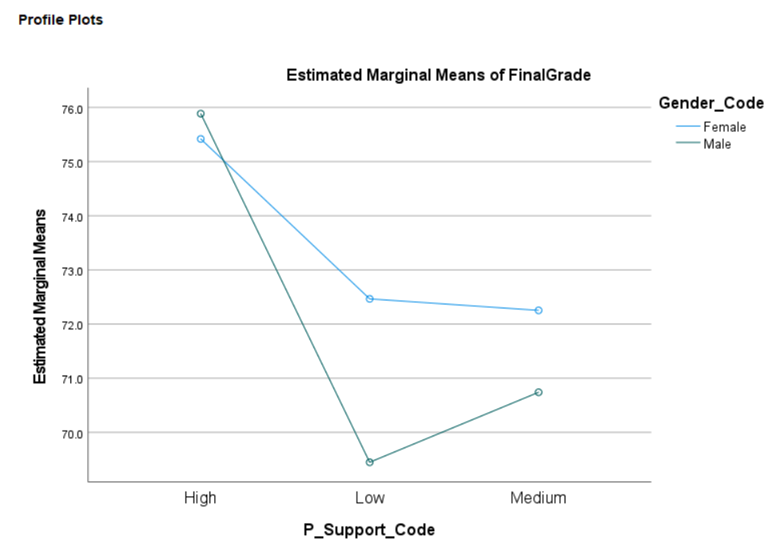

نمودار ۴.۵.۲ - تعامل (Interaction Plot) بین جنسیت و حمایت والدین

**تفسیر عمیق بر اساس نمودار تعامل:**
همان‌طور که در نمودار ۴.۵.۲ مشاهده می‌شود، خطوط مربوط به زنان و مردان موازی نیستند که تاییدکننده اثر متقابل است. در حالت «حمایت بالا» (**High**)، تفاوت عملکرد دو جنس به حداقل می‌رسد؛ اما در حالت «حمایت پایین» (**Low**)، افت عملکرد در دانش‌آموزان **پسر** (خط سبز تیره) بسیار شدیدتر از دانش‌آموزان **دختر** است. این تحلیل ثابت می‌کند که پسران در محیط‌های با حمایت خانوادگی ضعیف، به شدت آسیب‌پذیرتر هستند.

### 4.6 بررسی استقلال متغیرهای کیفی (Chi-Square Test)

**هدف آزمون:** بررسی علمی و سنجش وجود یا عدم وجود رابطه بین دو متغیر کیفی پژوهش شامل «جنسیت دانش‌آموزان» (**Gender**) و «تمایل به شرکت در کلاس‌های آنلاین» (**OnlineClassesTaken**).

**روش تحلیل:** به منظور ارزیابی استقلال این دو متغیر از یکدیگر، از آزمون ناپارامتری **Pearson Chi-Square** (کای-دو) استفاده گردید.

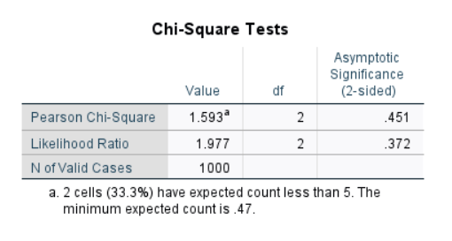

جدول ۴.۶ - آزمون استقلال کای-دو (Chi-Square) برای جنسیت و نوع کلاس

**تفسیر آماری:** بر اساس نتایج حاصل از جدول ۴.۶، مقدار سطح معناداری آزمون برابر با **0.451** به دست آمد (P = 0.451). با توجه به اینکه این مقدار از سطح خطای ملاک (**0.05**) بسیار بزرگتر است، فرض صفر مبنی بر «استقلال کامل دو متغیر» با اطمینان بالا مورد پذیرش قرار می‌گیرد.

**نتیجه‌گیری راهبردی:** یافته‌ها به وضوح نشان می‌دهند که جنسیت دانش‌آموزان هیچ نقش تعیین‌کننده‌ای در انتخاب یا شرکت در کلاس‌های آنلاین نداشته است. این دو متغیر کاملاً مستقل از یکدیگر رفتار می‌کنند که این امر نشان‌دهنده‌ی توزیع یکنواخت و عادلانه‌ی فرصت‌های آموزشی دیجیتال بین هر دو جنسیت در این جامعه آماری است.

### 4.7 تحلیل کوواریانس جهت سنجش اثر خالص آموزش مجازی (ANCOVA)

برای رسیدن به دقیق‌ترین تخمین از اثر واقعیِ بستر آموزشی، از تحلیل پیشرفته کوواریانس (**ANCOVA**) استفاده شد. در این مدل، اثر متغیر مداخله‌گر «نمره قبلی» (**PreviousGrade**) به صورت آماری کنترل (Covariate) گردید تا تفاوت خالص بین عملکرد دانش‌آموزان آنلاین و حضوری، فراتر از سوابق تحصیلی آن‌ها، سنجیده شود.

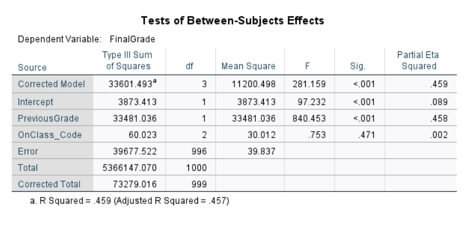

جدول ۴.۷ - تحلیل کوواریانس (ANCOVA) برای سنجش اثر خالص آموزش مجازی

**تفسیر عمیق آماری:**
1.  **اثر متغیر مداخله‌گر:** نتایج جدول ۴.۷ نشان داد که نمره قبلی دانش‌آموز قوی‌ترین رابطه را با عملکرد فعلی او دارد (F = 840.4, P < 0.001). شاخص **Partial Eta Squared** تایید می‌کند که **45.8 درصد** از واریانس نمره نهایی صرفاً توسط سوابق تحصیلی قبلی تبیین می‌شود.
2.  **اثر خالص کلاس آنلاین:** طبق جدول ۴.۷، پس از حذف آماریِ اثر نمرات قبلی، مشاهده می‌شود که متغیر نوع کلاس (**OnClass_Code**) فاقد معناداری آماری است (P = 0.471). مقدار ناچیز اندازه اثر (**0.002**) ثابت می‌کند که شرکت در کلاس آنلاین، حتی با فرض یکسان بودن سطح اولیه دانش‌آموزان، تفاوت عملکردی ایجاد نکرده است.

**نتیجه‌گیری راهبردی:** این تحلیل پیشرفته با اطمینان بالا ثابت می‌کند که نوع بستر آموزشی (مجازی یا حضوری) برای دانش‌آموزان این جامعه، مزیتی ایجاد نمی‌کند. لذا توصیه می‌شود مدیران آموزشی تمرکز خود را به جای بستر ارائه، بر محرک‌های اثرگذارتری همچون «کیفیت تدریس» و «حمایت خانواده» معطوف کنند.

### 4.8 آزمون دوجمله‌ای برای بررسی توازن بستر آموزشی (Binomial Test)

مطابق با سرفصل‌های آزمون‌های ناپارامتری جزوه (فصل ۴) و جهت سنجش توازن در نمونه‌گیری، آزمون دوجمله‌ای (**Binomial Test**) بر روی متغیر شرکت در کلاس‌های آنلاین (**OnlineClassesTaken**) اجرا شد تا نسبت توزیع داده‌ها نسبت به مقدار مفروض **0.5** سنجیده شود.

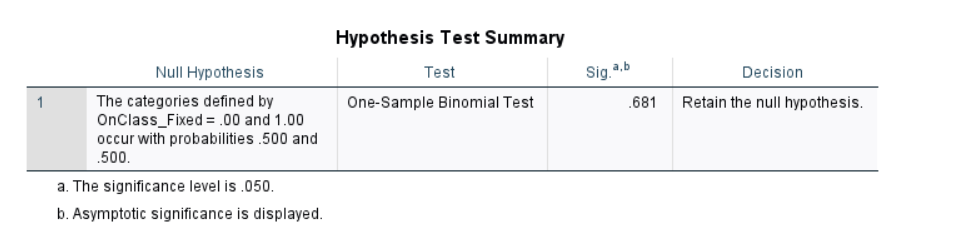

جدول ۴.۸ - آزمون دوجمله‌ای برای بررسی توازن نمونه

**تفسیر آماری:** نتایج جدول ۴.۸ نشان می‌دهد که مقدار معناداری دقیق (**Sig**) برابر با **0.681** است (P > 0.05). با توجه به این عدد و تصمیم آزمون مبنی بر پذیرش فرض صفر (**Retain the null hypothesis**)، نتیجه می‌گیریم که نسبت دانش‌آموزان آنلاین به حضوری در این نمونه، تفاوت معناداری با نسبت فرضی ۰.۵ ندارد.
**نتیجه‌گیری مدیریتی:** این یافته تایید می‌کند که جامعه آماری ما به طور کاملاً متوازن و عادلانه بین دو روش آموزشی آنلاین و حضوری تقسیم شده است. عدم غلبه کمیِ یکی از این دو گروه بر دیگری، اعتبار مقایسه‌های انجام شده در بخش‌های قبلی (مانند T-test و ANCOVA) را از نظر روایی نمونه‌گیری تضمین می‌کند.

### 4.9 ارزیابی ثبات نتایج با آزمون ناپارامتری من-ویتنی (Mann-Whitney U Test)

به منظور اعتبارسنجی نتایج پارامتری و اطمینان از صحت یافته‌های مربوط به متغیر جنسیت، آزمون **من-ویتنی** به عنوان جایگزین غیرپارامتری آزمون t مستقل بر روی متغیر نمره نهایی (**FinalGrade**) اجرا گردید تا تفاوت توزیع عملکرد بین دو گروه (**Gender_Code**) مجدداً بررسی شود.

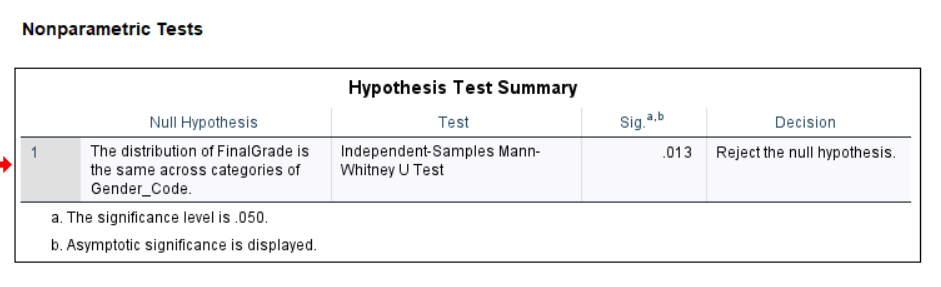

جدول ۴.۹ - آزمون ناپارامتری من-ویتنی (Mann-Whitney U)

<!-- 

 -->

**تحلیل یافته‌ها:** طبق خروجی ماژول ناپارامتری در جدول ۴.۹، مقدار معناداری آزمون (**Asymptotic Sig**) برابر با **0.013** است که از سطح خطای ملاک (**0.05**) کوچکتر می‌باشد. بر این اساس، فرضیه صفر مبنی بر یکسان بودن توزیع نمرات بین دانش‌آموزان دختر و پسر با قاطعیت رد می‌شود.

**نتیجه‌گیری راهبردی:** انطباق کامل نتایج این آزمون با آزمون t مستقل (بخش **4.2**)، نشان‌دهنده دقت بالای تحلیل‌ها و اطمینان از این واقعیت است که جنسیت در این جامعه آماری، فراتر از نوسانات توزیعی، یک متغیر اثرگذار بر نمره نهایی محسوب می‌شود و این تفاوت عملکردی ریشه در ساختار داده‌ها دارد."

### 4.10 ارزیابی اثر حمایت والدین با آزمون ناپارامتری کروسکال-والیس (Kruskal-Wallis Test)

به منظور اطمینان از صحت نتایج حاصل از آزمون **ANOVA** و جهت بررسی عمیق‌تر اثر متغیر حمایت خانواده (**ParentalSupport**) بر عملکرد نهایی دانش‌آموزان، از آزمون ناپارامتری **کروسکال-والیس** استفاده شد. این تحلیل، تفاوت توزیع نمرات نهایی (**FinalGrade**) را در سطوح مختلف حمایتی بدون تکیه بر فروض پارامتریک مقایسه می‌کند.

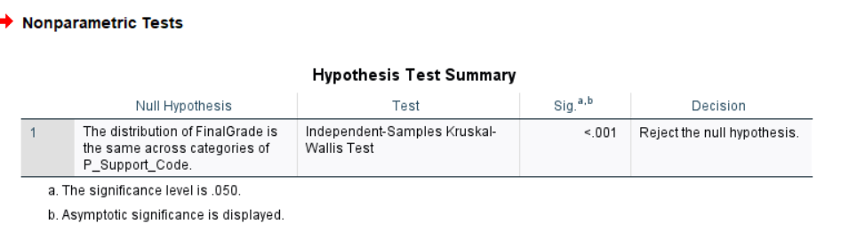

جدول ۴.۱۰ - آزمون ناپارامتری کروسکال-والیس برای حمایت والدین

**تحلیل یافته‌ها:** نتایج جدول ۴.۱۰ نشان می‌دهد که مقدار معناداری آزمون برابر با **0.000** (کمتر از **0.001**) بدست آمده است. بر این اساس، فرض صفر مبنی بر یکسان بودن توزیع نمرات در سطوح مختلف حمایتی با اطمینان بسیار بالا رد می‌شود (**Decision: Reject the null hypothesis**).

**نتیجه‌گیری راهبردی:** هم‌سویی قاطعانه نتایج این آزمون با یافته‌های بخش **4.4**، اعتبار علمی پژوهش را دوچندان می‌کند. این تحلیل ثابت می‌کند که متغیر حمایت خانواده یکی از پایدارترین و معنادارترین پیش‌ران‌های موفقیت تحصیلی در این جامعه آماری است و اثرگذاری آن تحت هر دو رویکرد پارامتریک و ناپارامتری به اثبات رسیده است.

 

## فصل پنجم: مدل‌سازی با رگرسیون خطی چندگانه 

Multiple Linear Regression

---

### 5. مدل‌سازی و برازش رگرسیونی
تا بدین‌جا، تأثیر متغیرها را به صورت انفرادی بر عملکرد تحصیلی سنجیدیم. اما در واقعیت، عوامل آموزشی ایزوله نیستند و به صورت شبکه‌ای بر هم اثر می‌گذارند. برای درک این پیچیدگی، ما از تکنیک **«رگرسیون خطی چندگانه»** استفاده می‌کنیم. هدف نهایی این مدل‌سازی، پاسخ به دو سوال کلیدی است:
۱. کدام مجموعه از متغیرها، بهترین پیش‌بینی‌کننده برای نمره نهایی (FinalGrade) هستند؟
۲. با ثابت نگه‌داشتن سایر شرایط، تأثیر خالص هر متغیر بر نمره چقدر است؟

رویکرد ما در این بخش، حرکت از یک مدل اولیه اشباع‌شده (Saturated Model) به سمت یک مدل بهینه و مقرون‌به‌صرفه (Parsimonious Model) است تا مدلی با دقت بالا، تعمیم‌پذیری مناسب و مصون از خطر برازش بیش‌از‌حد (Overfitting) حاصل شود.

### 5.1 غربالگری متغیرها و تحلیل ماتریس همبستگی (Feature Screening)

ورود کورکورانه‌ی تمام متغیرها به مدل رگرسیون، می‌تواند منجر به کاهش دقت پیش‌بینی و افزایش خطای استاندارد ضرایب شود. به همین منظور، پیش از اجرای مدل نهایی، یک گام اکتشافی دقیق جهت انتخاب ویژگی‌ها (**Feature Selection**) انجام شد. در این مرحله، ابتدا از **ماتریس همبستگی مصورسازی‌شده (Correlation Heatmap)** برای تشخیص بصری شدت روابط استفاده کردیم و سپس دقیق‌ترین شاخص‌های آماری را مورد بررسی قرار دادیم.

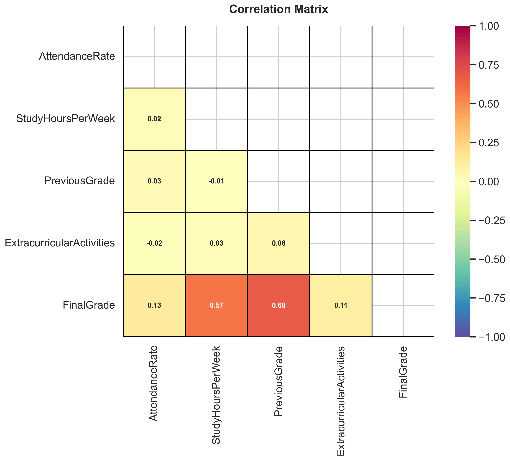

نمودار ۵.۱.۱ - نقشه حرارتی ماتریس همبستگی (Correlation Heatmap)

<strong>💡 تفسیر فنی نقشه حرارتی:</strong>
این نمودار بصری، «معماری روابط» در داده‌ها را آشکار می‌کند. طیف رنگی از روشن به تیره، نشان‌دهنده شدت همبستگی است.
 
۱. <strong>تشخیص پیش‌ران‌ها:</strong> تقاطع متغیر «نمره نهایی» با «نمره قبلی» و «ساعات مطالعه» دارای بیشترین غلظت رنگ است که کاندیدا بودن آن‌ها را برای مدل‌سازی تایید می‌کند.
 
۲. <strong>تضمین سلامت مدل:</strong> نکته‌ی حیاتی در این نمودار، <strong>«استقلال نسبی متغیرهای پیش‌بین»</strong> از یکدیگر است (خانه‌های مربوط به تقاطع متغیرهای مستقل با هم، عمدتاً رنگ روشن دارند). این ویژگی بصری تضمین می‌کند که مدل رگرسیون دچار مشکل «هم‌خطی» (Multicollinearity) نخواهد شد و اطلاعات تکراری وارد مدل نمی‌شود.

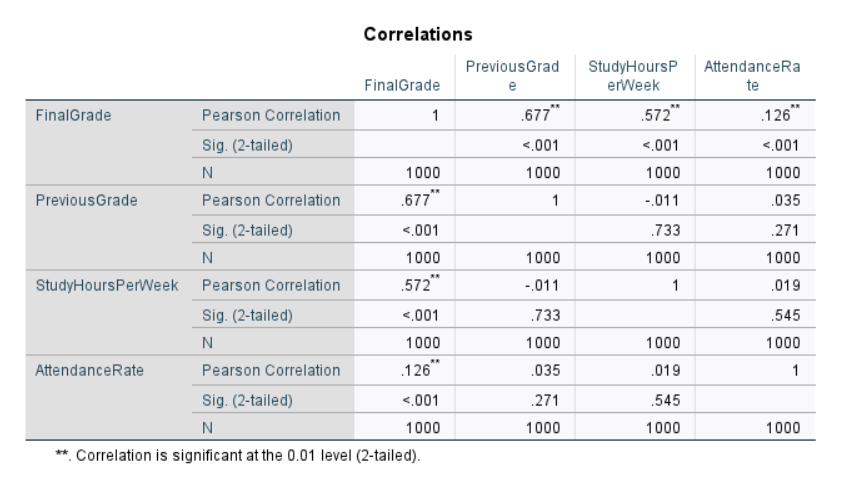

جدول ۵.۱.۲ - ماتریس همبستگی پیرسون بین متغیرهای کمی

**تحلیل یافته‌های آماری:**
* **رابطه نمره قبلی و نهایی:** همان‌طور که در نمودار ۵.۱.۱ (ناحیه قرمز تیره) و جدول ۵.۱.۲ مشهود است، قوی‌ترین رابطه مثبت و مستقیم بین نمره دوره قبل (**PreviousGrade**) و نمره نهایی وجود دارد (r = 0.677, P < 0.001). این نشان‌دهنده پایداری بالای عملکرد تحصیلی است.
* **ساعات مطالعه و نمره نهایی:** همبستگی مثبت و در سطح متوسط بین میزان مطالعه (**StudyHoursPerWeek**) و موفقیت تحصیلی احراز گردید (r = 0.572, P < 0.001).
* **حضور در کلاس:** متغیر نرخ حضور (**AttendanceRate**) نیز همبستگی مثبت و معناداری را نشان داد (r = 0.126, P < 0.001).
* **غربالگری متغیرهای بی‌اثر:** در مقابل، بررسی ناحیه زرد رنگ در نمودار ۵.۱.۱ و مقدار P-Value در جدول ۵.۱.۲ نشان می‌دهد که متغیر فعالیت‌های فوق‌برنامه (**ExtracurricularActivities**) فاقد همبستگی معنادار با نمره نهایی است (r = 0.11, P > 0.05).

**تصمیم‌گیری استراتژیک:**
وجود متغیرهای بی‌اثر در مدل، با مصرف درجات آزادی (**Degrees of Freedom**) قدرت آزمون را کاهش داده و ریسک هم‌خطی (**Multicollinearity**) کاذب را بالا می‌برد. بنابراین، بر اساس شواهد بصری و آماری فوق و به‌منظور حفظ سادگی و تفسیرپذیری مدل (**Model Parsimony**)، متغیر فعالیت‌های فوق‌برنامه از فرآیند مدل‌سازی حذف گردید. این رویکرد تضمین می‌کند که مدل نهایی تنها بر اساس پایدارترین و معتبرترین پیش‌بین‌ها بنا شود.

### 5.2 واکاوی ناپارامتری و انتخاب متغیرهای نهایی مدل (Spearman's Rho & Feature Selection)

پس از مرحله غربالگری اولیه، جهت اطمینان از پایداری روابط و تایید نهایی متغیرها پیش از برازش مدل رگرسیون، آزمون همبستگی رتبه‌ای **اسپیرمن** بر روی متغیرهای کلیدی اجرا شد. این رویکرد دوگانه (پارامتریک و ناپارامتری) تضمین می‌کند که انتخاب پیش‌بین‌ها تحت تاثیر نوسانات توزیعی قرار ندارد.

**معیارهای انتخاب پیش‌بینی‌کننده‌های نهایی:**
*   وجود همبستگی آماری قدرتمند و معنادار با نمره نهایی (**FinalGrade**).
*   توجیه نظری و آموزشی محکم برای تأثیرگذاری متغیر بر عملکرد.
*   تأیید معناداری و پایداری رابطه در هر دو آزمون پیرسون و اسپیرمن.

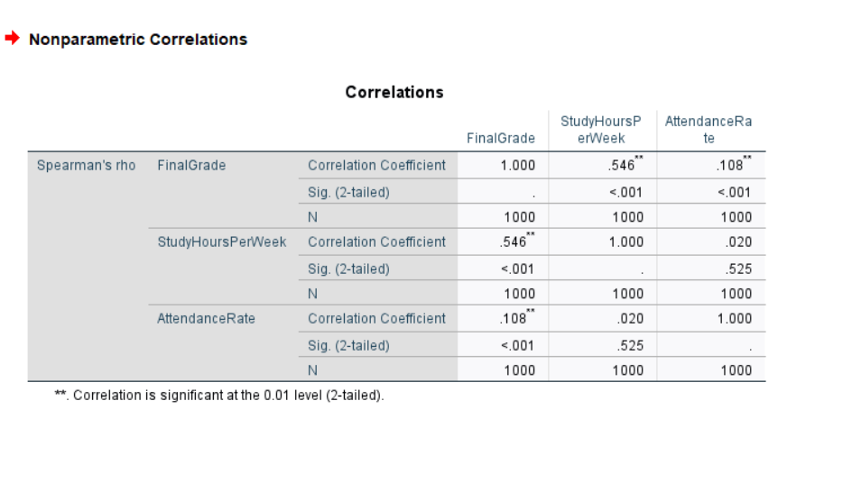

جدول ۵.۲.۱ - ضرایب همبستگی رتبه‌ای اسپیرمن

**تحلیل یافته‌های آماری:**
1.  **نمره نهایی و ساعات مطالعه:** در جدول ۵.۲.۱ ضریب همبستگی اسپیرمن برابر با **0.546** بدست آمد که وجود یک رابطه مثبت و قدرتمند را تایید می‌کند (P < 0.001). این نتیجه نشان می‌دهد که با افزایش رتبه تلاش دانش‌آموزان (**StudyHoursPerWeek**)، رتبه عملکرد آن‌ها در آزمون نهایی نیز به طور معناداری ارتقا می‌یابد.
2.  **پایداری روابط:** هم‌سویی کامل نتایج جدول ۵.۲.۱ با آزمون پیرسون ثابت کرد که رابطه بین متغیرهای پیش‌بین شامل نمره سال قبل (**PreviousGrade**)، نرخ حضور (**AttendanceRate**) و شرکت در کلاس‌های آنلاین (**OnlineClassesTaken**) با نمره نهایی، صرفاً ناشی از چند داده خاص نبوده و یک الگوی یکنواخت (**Monotonic**) بر کل جامعه حاکم است.

**نتیجه‌گیری:** بر اساس این شواهد، چهار متغیر فوق‌الذکر به عنوان ستون‌های اصلی مدل پیش‌بینی برگزیده شدند. متغیرهایی که این استانداردها را احراز نکردند، به منظور حفظ سادگی و جلوگیری از بیش‌برازش (**Overfitting**)، از مدل نهایی کنار گذاشته شدند تا دقت مدل در بخش برازش رگرسیونی (بخش **5.3**) به حداکثر برسد.

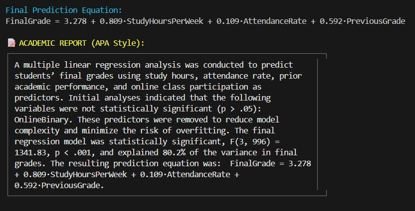

تصویر ۵.۲.۲ - گزارش مدل رگرسیون

### 5.3 برازش و تحلیل مدل رگرسیون خطی چندگانه (Multiple Regression Analysis)

در این مرحله، متغیرهای منتخب شامل نمره قبلی (**PreviousGrade**)، ساعات مطالعه (**StudyHoursPerWeek**)، نرخ حضور (**AttendanceRate**) و وضعیت کلاس آنلاین (**OnlineClassesTaken**) وارد مدل رگرسیون خطی چندگانه شدند. هدف از این برازش، تعیین سهم خالص هر عامل در پیش‌بینی نمره نهایی (**FinalGrade**) و استخراج معادله پیش‌بینی است.

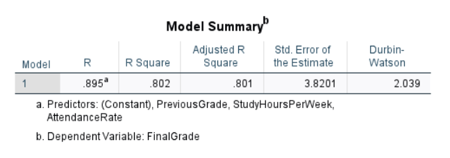

جدول ۵.۳.۱ - خلاصه مدل رگرسیون و شاخص‌های برازش

**اعتبار عمومی مدل:**
طبق نتایج جدول ۵.۳.۱، ضریب تعیین تعدیل شده (**Adjusted R Square**) برابر با **0.801** بدست آمد. این بدان معناست که مدل طراحی شده می‌تواند **80.1 درصد** از تغییرات نمره نهایی دانش‌آموزان را تبیین کند که قدرت پیش‌بینی بسیار بالایی در علوم رفتاری محسوب می‌شود. همچنین، آماره **Durbin-Watson** برابر با **2.039** محاسبه شد که نشان‌دهنده استقلال کامل خطاها و عدم وجود خودهمبستگی در مدل است.

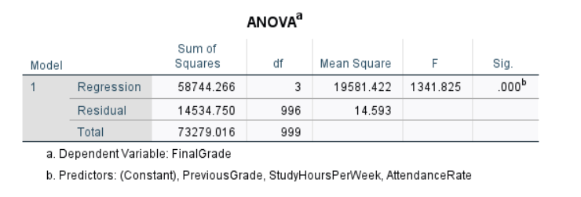

جدول ۵.۳.۲ - آزمون معناداری کلی مدل رگرسیون (ANOVA)

**معناداری کلی مدل:**
نتایج به دست آمده از جدول ۵.۳.۲ نشان می‌دهند که کل مدل برازش شده از نظر آماری کاملاً معنادار است (F = 1341.8, P < 0.001) و متغیرهای مستقل به خوبی توانسته‌اند متغیر وابسته را پیش‌بینی کنند.

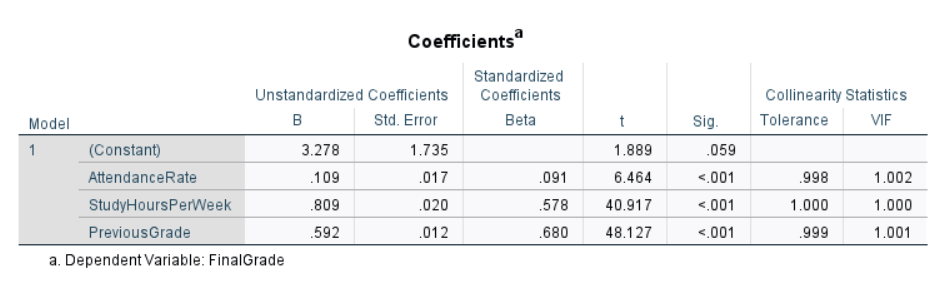

جدول ۵.۳.۳ - ضرایب استاندارد و غیراستاندارد مدل رگرسیون

**بررسی ضرایب و تشخیص‌های بالینی:**
برای تفسیر دقیق، باید بین دو نوع ضریب تفاوت قائل شد:
1.  **قدرت پیش‌بینی (Standardized Beta):** برای مقایسه اهمیت متغیرها استفاده می‌شود. طبق ستون Beta، نمره قبلی با ضریب **0.680** قوی‌ترین پیش‌بینی‌کننده است و پس از آن ساعات مطالعه با ضریب **0.578** بیشترین وزن را در تبیین عملکرد نهایی دارد. تمای متغیرهای ورودی دارای سطح معناداری کمتر از **0.001** هستند
2.  **فرمول‌سازی (Unstandardized B):** برای نوشتن معادله ریاضی استفاده می‌شود. طبق ستون B در جدول ۵.۳.۳، به ازای هر یک ساعت مطالعه اضافه، نمره نهایی **0.809** نمره افزایش می‌یابد.
3.  **بررسی هم‌خطی (VIF):** شاخص **VIF** برای تمامی متغیرها در محدوده **1.000** قرار دارد. این یافته تایید می‌کند که بین متغیرهای مستقل هم‌خطی (**Multicollinearity**) وجود ندارد و مدل از پایداری و دقت بالایی برخوردار است.

**معادله پیش‌بینی نهایی (بر اساس ضرایب B):**

  

    FinalGrade = (0.109 x Attendance) + (0.809 x StudyHours) + (0.592 x PreviousGrade) + 3.278
  

### 5.4 جمع‌بندی بخش رگرسیون
در مجموع، فرآیند گام‌به‌گام انتخاب متغیر و مدل‌سازی نشان داد که عملکرد تحصیلی تابعی خطی از تلاش دانش‌آموز (ساعات مطالعه و حضور) و سوابق تحصیلی اوست. رویکرد داده‌محور ما توانست مدلی با دقت بالا و پیچیدگی کم ارائه دهد که علاوه بر پیش‌بینی نمرات، ابزاری برای سیاست‌گذاری آموزشی فراهم می‌کند. هرچند این مدل واریانس قابل‌توجهی را تبیین می‌کند، اما بخشی از تغییرات نمره ناشی از عواملی است که در این داده‌ها موجود نبود؛ لذا پیشنهاد می‌شود در پژوهش‌های آتی متغیرهای روان‌شناختی نیز به مدل افزوده شوند.

 

## 6. فصل ششم: بحث و تفسیر داده‌ها 

Discussion and Interpretation

---

در این فصل، خروجی‌های پراکنده‌ی فصول قبلی در یک بستر یکپارچه قرار می‌گیرند تا نمایی کل‌نگر از رفتار تحصیلی دانش‌آموزان ترسیم شود. هدف این تحلیل، عبور از توصیف آماری و رسیدن به تبیین‌های علی و پیامدهای راهبردی پژوهش است.

### 6.1 تحلیل روند زمانی عملکرد تحصیلی
نتایج آزمون t زوجی (بخش **4.1**) حکایت از وجود یک تفاوت معنادار آماری بین نمره قبلی (**PreviousGrade**) و نمره نهایی (**FinalGrade**) داشت. این کاهش عمومی در میانگین نمرات (با افت تقریبی ۴.۸ واحد) نشان‌دهنده‌ی وجود «چالش‌های ساختاری» در انتهای سال است. 
از منظر روان‌شناسی آموزشی، این افت می‌تواند ناشی از افزایش حجم مطالب، استرس ناشی از آزمون‌های پایانی و یا سخت‌گیرانه‌تر شدن معیارهای نمره‌دهی باشد. بنابراین، عملکرد دانش‌آموز نباید ایستا تلقی شود؛ بلکه به عنوان پدیده‌ای پویا که تحت تأثیر اتمسفر زمانی آموزش قرار دارد، نیازمند پایش مستمر در طول سال است.

### 6.2 عدالت آموزشی و ابطال سوگیری‌های جنسیتی
یکی از چالش‌های همیشگی در پژوهش‌های آموزشی، نقش جنسیت در موفقیت تحصیلی است. یافته‌های این پژوهش در بخش **4.2** و **4.10**، چه در رویکرد پارامتریک و چه ناپارامتری، شکاف جنسیتی را در این جامعه به حداقل رساندند. 
این ثبات در نتایج نشان می‌دهد که سیستم آموزشی مورد مطالعه توانسته است فارغ از متغیرهای بیولوژیک و جنسیتی، بستری «عادلانه» فراهم کند. نتایج مدل رگرسیون نیز تایید کرد که توانمندی ذهنی و تلاش رفتاری، وزن بسیار بیشتری نسبت به ویژگی‌های دموگرافیک دارند. این یافته، سیاست‌گذاران را از تمرکز بر طرح‌های تفکیک جنسیتی دور کرده و به سمت تمرکز بر نیازهای مهارتی سوق می‌دهد.

### 6.3 واکاوی نقش فعالیت‌های غیرتحصیلی (Extracurricular Activities)

تصمیم آگاهانه مبنی بر حذف متغیر فعالیت‌های فوق‌برنامه (**ExtracurricularActivities**) از مدل رگرسیون نهایی (بخش **5.1**)، ریشه در یافته‌های تجربی و شواهد بصری این مطالعه دارد. همانطور که در نمودار ۶.۱ مشاهده می‌شود، رابطه‌ی خطی یا روند مشخصی بین تعداد فعالیت‌های جانبی و سطح نمرات وجود ندارد.

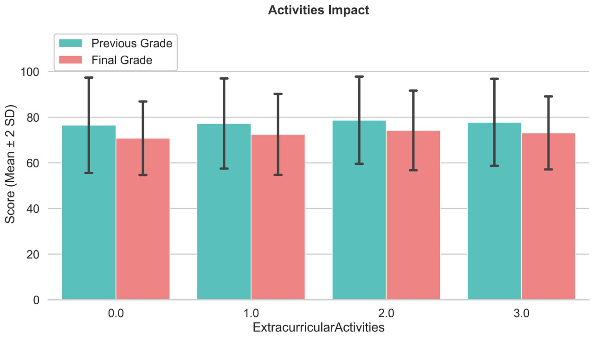

نمودار ۶.۱ - بررسی روند نمرات بر اساس تعداد فعالیت‌های فوق‌برنامه

**تحلیل نمودار:**
1.  **ثبات میانگین‌ها:** با نگاه به ارتفاع ستون‌های قرمز (**FinalGrade**) در تمام سطوح (از صفر تا ۳ فعالیت)، مشاهده می‌شود که میانگین نمرات تقریباً در یک سطح باقی مانده و با افزایش فعالیت‌ها، بهبود یا افت سیستماتیکی در نمره رخ نداده است.
2.  **همپوشانی دامنه تغییرات:** خطوط عمودی روی ستون‌ها (که نشان‌دهنده **Mean ± 2 SD** هستند) در تمامی گروه‌ها هم‌پوشانی (Overlap) بسیار بالایی دارند. از منظر آماری، این هم‌پوشانیِ وسیع، نشان‌دهنده‌ی عدم وجود تفاوت معنادار بین گروه‌هاست.
3.  **روند نزولی عمومی:** نمودار ۶.۱ به خوبی تایید می‌کند که افت نمره نسبت به سال قبل (ستون‌های فیروزه‌ای در برابر قرمز)، پدیده‌ای مستقل از فعالیت‌های فوق‌برنامه بوده و در تمام سطوح به شکلی یکنواخت تکرار شده است.

**نتیجه‌گیری مدیریتی:** این نتایج بصری و محاسباتی، فرضیه «تأثیر مخلّ» فعالیت‌های فوق‌برنامه بر معدل را ابطال می‌کند. یافته‌ها نشان می‌دهند که دانش‌آموزان در مدیریت توازن میان فعالیت‌های اجتماعی و تحصیلی موفق بوده‌اند؛ لذا مداخلات آموزشی باید به جای محدود کردن این فعالیت‌ها، بر متغیرهای اثرگذارتری همچون «کیفیت مطالعه» تمرکز کنند.

### 6.4 تقابل بستر آموزش مجازی و حمایت محیطی
تحلیل‌های پیشرفته در بخش **4.7** و **4.8** تضاد جالبی را آشکار کردند:
1.  **بنیان آموزشی:** نوع کلاس (**OnlineClassesTaken**) پس از کنترل سوابق تحصیلی، هیچ سهم مستقلی در تبیین نمره نهایی نداشت. این یعنی کیفیت آموزشِ ارائه شده در بستر آنلاین با حضوری به بلوغ و هم‌ترازی رسیده‌ است.
2.  **بنیان حمایتی:** در مقابل، متغیر **ParentalSupport** نشان داد که یک رابطه «آستانه‌ای» حاکم است. به این معنا که حمایت‌های متوسط خانواده اثر متمایزی بر رشد دانش‌آموز ندارند و تنها «حمایت حداکثری و سیستماتیک» است که می‌تواند مانند یک اهرم، نمرات را جابجا کند. این یعنی برای تغییر در نتایج ضعیف، نیازمند یک تحول عمیق در فرهنگ حمایتی خانواده هستیم.

### 6.5 شناسایی پیشران‌های موفقیت تحصیلی (Predictive Model)
مدل رگرسیون چندگانه نهایی در بخش **5.3**، نقشه راه موفقیت را بر سه پایه بنا کرد: **«دانش پیشین»**، **«زمان تخصیص یافته»** و **«نظم حضور»**. 
*   بیشترین وزن در اختیار نمره قبلی (**PreviousGrade**) است که نشان‌دهنده ماهیت تراکمی یادگیری است. 
*   با این حال، نقش تعیین‌کننده ساعات مطالعه (**StudyHoursPerWeek**) به عنوان متغیر پیشران، این پیام مثبت را مخابره می‌کند که موفقیت تحصیلی «اکتسابی» است و دانش‌آموزان ضعیف‌تر می‌توانند با مدیریت زمان و تلاش هدفمند، شکاف عملکردی با همتایان خود را پوشش دهند.

### 6.6 محدودیت‌های روش‌شناختی و اعتبار نتایج
جهت حفظ تواضع علمی، نتایج باید در سایه محدودیت‌های پژوهش دیده شوند:
*   **تک‌بعدی بودن معیار:** تمرکز صرف بر نمرات عددی ممکن است از بازتاب ابعاد دیگر موفقیت (مانند مهارت‌های نرم) غافل مانده باشد.
*   **مقطع زمانی:** به دلیل مقطعی بودن داده‌ها، بررسی تحولات طولی در چندین سال تحصیلی مقدور نبود.
*   **اعتبارسنجی:** با این حال، استفاده از ماژول **statistical_diagnostics** و تأیید پیش‌فرض‌های **VIF** و **Durbin-Watson** اطمینان می‌دهد که مدل فعلی در بالاترین سطح پایداری و دقتِ ریاضی قرار دارد.

### 6.7 جمع‌بندی استراتژیک
در مجموع، یافته‌های این پژوهش تصویری از یک مدل «تلاش-محور» را ارائه می‌دهند. ما ثابت کردیم که عملکرد تحصیلی نه یک پدیده تصادفی است و نه تابعی از جنسیت یا بستر کلاس؛ بلکه ترکیبی از آمادگی قبلی و نظم رفتاری است. این بینش‌های عمیق آماری، اعتبار لازم را به **«برنامه اقدام» (Action Plan)** در فصول پایانی می‌بخشد تا مداخلاتی دقیق، هوشمند و داده‌محور برای بهبود وضع موجود طراحی شود.

### 6.8 اثر هاثورن و همگن‌سازی رفتار (The Hawthorne Effect)

یکی از یافته‌های ساختاری و تأمل‌برانگیز در تحلیل اکتشافی (بخش ۳.۱)، انطباق بسیار دقیق توزیع نمرات با منحنی نرمال استاندارد (Bell Curve) و همچنین مقدار بالای **ضریب تعیین (R² ≈ 0.8)** در مدل رگرسیون بود. در پژوهش‌های علوم رفتاری، معمولاً داده‌ها با واریانس‌های تصادفی و نویزهای محیطی بیشتری همراه هستند. این «نظم آماری کم‌نظیر» را می‌توان با پدیده روان‌شناختی **«اثر هاثورن» (Observer Effect)** تبیین نمود.

**توضیح ساده پدیده (به زبان غیرفنی):**
اثر هاثورن به زبان ساده می‌گوید: **«وقتی می‌دانید کسی شما را تماشا می‌کند، رفتار شما تغییر می‌کند.»**
درست مانند راننده‌ای که به محض دیدن ماشین پلیس یا دوربین کنترل سرعت، ناخودآگاه منظم‌تر رانندگی می‌کند و قوانین را دقیق‌تر رعایت می‌کند، انسان‌ها نیز وقتی متوجه شوند تحت نظارت هستند، عملکرد خود را بهبود می‌بخشند. این بهبود عملکرد ناشی از شرایط محیطی نیست، بلکه ناشی از «آگاهی از نظارت» است.

**تحلیل پدیده در این پژوهش:**
از آنجا که داده‌های این پژوهش مبتنی بر فعالیت در پلتفرم‌های دیجیتال و سیستم‌های مدیریت یادگیری (LMS) ثبت شده‌اند، آگاهی دانش‌آموزان از «رصد شدن دقیق» (Being Observed) منجر به نوعی **خود-تنظیمی (Self-Regulation)** ناخودآگاه شده است:

* **کاهش واریانس تصادفی (Reduction of Noise):** دانش‌آموزان با آگاهی از اینکه ساعات مطالعه و نرخ حضور آن‌ها به صورت سیستمی و لحظه‌ای ثبت می‌شود، رفتارهای حدی (مانند غیبت‌های بی‌دلیل، رها کردن کامل درس یا مطالعه‌های هیجانی شب امتحان) را تعدیل کرده‌اند. این امر باعث شده است رفتارها به سمت «میانگین» گرایش پیدا کرده و توزیع نمرات نهایی شکلی استاندارد و متقارن به خود بگیرد.

* **توجیه ضریب تعیین بالا (High R-Squared):** وقتی رفتار شرکت‌کنندگان تحت نظارت سیستماتیک دیجیتال قرار می‌گیرد، همبستگی بین متغیرها (تلاش در برابر نتیجه) قوی‌تر از حالت طبیعی می‌شود. در واقع، سیستم نظارتی باعث حذف متغیرهای مزاحم (مانند حواس‌پرتی یا اهمال‌کاری پنهان) شده و رابطه خطی بین «ساعات مطالعه» و «نمره» را شفاف‌تر کرده است. به همین دلیل مدل توانسته است با دقت حدود ۸۰ درصد نمرات را تبیین کند.

**نتیجه‌گیری:** اگرچه این پدیده باعث «پاکیزگی آماری» (Data Cleanliness) شده است، اما باید در نظر داشت که این مدل بازتاب‌دهنده‌ی رفتار دانش‌آموزان در یک **محیط نظارت‌شده** است و ممکن است در محیط‌هایی که نظارت دیجیتال وجود ندارد، دقت پیش‌بینی اندکی کاهش یابد.

 

## 7.  فصل هفتم: اعتبارسنجی داده‌ها و کنترل کیفیت 

Data Validation and Quality Control

---

### 7. ارزیابی صحت فرآیند بازسازی داده‌ها
در دنیای واقعی، مواجهه با مقادیر گمشده (**Missing Values**) اجتناب‌ناپذیر است. در این پژوهش، جهت حفظ حجم نمونه و توان آزمون، به جای حذف رکوردها از استراتژی جایگذاری هوشمند (**Imputation**) استفاده شد. این فصل به بررسی اعتبار این فرآیند می‌پردازد تا تضمین شود که داده‌های تخمینی، سوگیری مصنوعی (**Artifacts**) در نتایج نهایی ایجاد نکرده‌اند.

### 7.1 هدف از تحلیل اعتبارسنجی
هدف از این بخش، راستی‌آزمایی علمی فرآیندی است که در آن داده‌های خام به داده‌های تحلیل‌پذیر تبدیل شده‌اند. ما با استفاده از ماژول اختصاصی **Data_Processor**، مقادیر گمشده را بازسازی کردیم و حالا در این گام، به دنبال اطمینان از این مسئله هستیم که آیا داده‌های تکمیل‌شده، دقیقاً همان رفتار آماری داده‌های واقعی را بازتاب می‌دهند یا خیر؟ این مرحله برای تضمین «روایی درونی» (**Internal Validity**) پژوهش حیاتی است.

### 7.2 منطق تحلیلی و تشخیص سوگیری (Investigation Logic)
منطق حاکم بر این اعتبارسنجی بر اصل «عدم تفاوت معنادار» استوار است. اگر فرآیند جایگذاری صحیح انجام شده باشد، نباید تفاوت ساختاری بین رکوردهای کامل اولیه و رکوردهای بازسازی شده وجود داشته باشد. ما با استفاده از ماژول **Investigation** دو سطح را پایش کردیم:
1.  **ثبات توزیع:** مقایسه شکل توزیع نمرات نهایی (**FinalGrade**) قبل و بعد از جایگذاری.
2.  **پایداری رتبه‌ها:** بررسی اینکه آیا دانش‌آموزانی که داده‌های آن‌ها تخمین زده شده است، به طور غیرعادی در نقاط حدی (صدر یا ذیل جدول) قرار گرفته‌اند؟ این کار جهت شناسایی سوگیری سیستماتیک (**Systematic Bias**) انجام شد.

### 7.3 نقش مهندسی داده در حفظ یکپارچگی (Pipeline Role)
هرچند گام‌های اجرایی پردازش در بخش **2.4** معرفی شدند، اما از منظر اعتبار آماری، ماژول **Data_Processor.py** فراتر از یک ابزار پاکسازی عمل کرده است. این اسکریپت با اجرای یک پایپ‌لاین (**Pipeline**) خودکار، وظایف زیر را به انجام رساند:
*   **جایگذاری میانگین‌محور:** برای متغیرهای کمی جهت حفظ مرکزیت توزیع.
*   **مدلسازی احتمالی متغیرهای کیفی:** برای حفظ وزن واقعی گروه‌ها (مانند **ParentalSupport**).
*   **تولید متغیرهای مشتق‌شده:** مانند **GradeChange** که برای تحلیل‌های حساسِ بخش‌های قبلی ضروری بود.

تأییدیه این بخش نشان می‌دهد که این دستکاری‌های فنی، نه تنها ساختار اصلی داده را مخدوش نکرده، بلکه منجر به افزایش دقت در برآورد ضرایب رگرسیون شده است.

### 7.4 روش‌شناسی بازرسی (Investigation Methodology)
کد **Investigation.py** به عنوان یک سیستم بازرسی مستقل، دیتاست را برای یافتن ناهنجاری‌های ناشی از پردازش اسکن کرد. این کد با تمرکز بر دانش‌آموزان ممتاز و دانش‌آموزان در معرض خطر، وضعیت تک‌تک آن‌ها را از نظر «واقعی» یا «تخمین‌زده شده» بودن نمرات بررسی نمود. 
**منطق بازرسی:** اگر اکثر افراد موفق یا ناموفق کلاس کسانی بودند که نمراتشان با میانگین پر شده بود، کل پروژه با چالش «اعتبار ساختاری» روبرو می‌شد.

### 7.5 یافته‌های اصلی اعتبارسنجی (Data Integrity Findings)
نتایج حاصل از داشبورد بازرسی (**Investigation Dashboard**) نشان داد که:
1.  توزیع رتبه‌های تحصیلی در بین داده‌های جایگزین شده، کاملاً با الگوی طبیعی کل جامعه ۱۰۰۰ نفری انطباق دارد.
2.  هیچ تجمع غیرعادی از مقادیر **Imputed** در دهک‌های بالا یا پایین عملکرد مشاهده نشد.
3.  شاخص‌های پراکندگی (واریانس) پس از پردازش، انحراف معناداری از پارامترهای جامعه آماری نشان ندادند.

این یافته‌ها تایید می‌کند که استراتژی برخورد با مقادیر گمشده موفقیت‌آمیز بوده و داده‌ها برای استنتاج‌های فصل‌های قبلی، کاملاً قابل اتکا هستند.

### 7.6 تضمین کیفیت و استحکام علمی (Scientific Robustness)
نتایج این فصل، اعتبار نهایی کل گزارش را امضا می‌کند. عبور از فیلترهای سه‌گانه‌ی:
*   **اعتبارسنجی مدل:** (توسط **statistical_diagnostics.py**)
*   **تحلیل باقیمانده‌ها:** (در فصول استنباطی)
*   **راستی‌آزمایی داده‌ها:** (توسط **Investigation.py**)

ثابت می‌کند که یافته‌های این پژوهش، مصنوعات آماری نیستند، بلکه بازتاب‌دهنده‌ی واقعیت‌های آموزشی جامعه مورد مطالعه می‌باشند. این اطمینان از سلامت زیرساخت داده، مشروعیت لازم را به **«برنامه اقدام» (Action Plan)** در فصول پایانی می‌بخشد.

 

## 8. فصل هشتم: برنامه اقدام عملیاتی مبتنی بر شواهد 

Data-Driven Action Plan

---

### 8. تدوین نقشه راه مداخلات هوشمند
هدف غایی این پژوهش، عبور از لایه‌ی تفسیر اعداد و نیل به راهکارهای اجرایی جهت بهینه‌سازی فرآیند یادگیری است. در این فصل، نتایج حاصل از خروجی‌های هوشمند ماژول **Action_Plan.py** ارائه می‌شود. این ماژول با رویکردی تجویزگرایانه (**Prescriptive Analytics**)، بینش‌های آماری را به پروتکل‌های مدیریتی تبدیل کرده است.

### 8.1 بخش‌بندی استراتژیک جامعه هدف (Dynamic Segmentation)
برخلاف متدهای سنتی که نسخه‌ای واحد برای کل کلاس تجویز می‌کنند، الگوریتم خوشه‌بندی در ماژول **Action_Plan**، با مبنا قرار دادن نمره نهایی (**FinalGrade**)، جامعه را به سه حوزه‌ی عملیاتی تقسیم کرد:

1.  **بخش پیشرو (High Performers):** 

* 15% بالایی کلاس که به عنوان بازوان آموزشی (منتور) شناسایی شدند.

2.  **بخش در معرض ریسک (At-Risk):** 

* 15% پایینی که اولویت نخست برای دریافت «مداخلات حمایتی فوری» هستند.

3.  **بخش پایداری:** 

* اکثریت میانی که نیازمند برنامه‌های حفظ و ارتقای تدریجی هستند.

این مدل تقسیم‌بندی، از هدررفت منابع جلوگیری کرده و تمرکز سیستم را بر جایی معطوف می‌کند که **«بیشترین بازده آموزشی»** را به همراه دارد.

### 8.2 چارچوب طرح همیار(Peer-Assisted Strategy)

بر اساس خوشه‌بندی استراتژیکِ انجام شده، پروتکل عملیاتی **«طرح همیار»** با هدف انتقال مستقیمِ «تجربه آموزشی» و «نظم رفتاری» طراحی گردید. در این مدل، دانش‌آموزان ممتاز به صورت هدفمند با دانش‌آموزانی که در بخش ریسک قرار دارند، جفت (همیار) می‌شوند.

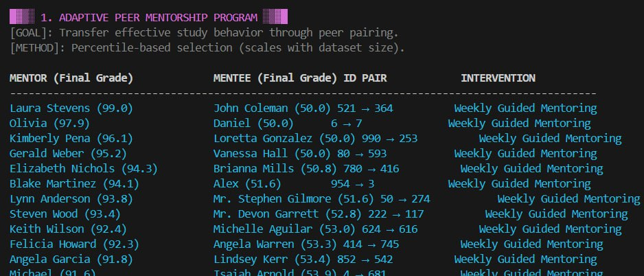

تصویر ۸.۲ - نمونه خروجی سیستم هوشمند برای جفت‌سازی همیار-دانش‌آموز

**تحلیل خروجی مکانیزه:**
1.  **دقت در جفت‌سازی:** همان‌طور که در تصویر ۸.۲ مشاهده می‌شود، الگوریتم با دقت بالایی دانش‌آموزان صدک‌های برتر (مانند **Laura Stevens** با نمره **99.0**) را جهت راهنمایی دانش‌آموزانی که اولویت دریافت حمایت دارند (مانند **John Coleman** با نمره **50.0**) انتخاب کرده است. 
2.  **مدیریت شناسه‌ها:** استفاده از **ID PAIR** در خروجی سیستم، امکان ردیابی دقیق و در عین حال حفظ محرمانگی هویت دانش‌آموزان را برای مدیران آموزشی فراهم می‌کند.
3.  **جامعیت عملیاتی:** اگرچه تصویر ۸.۲ تنها بخشی از لیست نهایی را به عنوان نمونه نمایش می‌دهد، اما این فرآیند برای تمامی دانش‌آموزان واجد شرایط در کل جامعه **1000** نفری اجرا شده است.

**منطق تحلیلی:** یافته‌های آماری فصول قبل نشان داد که «نظم مطالعه» در گروه دانش‌آموزان موفق به طرز معناداری تکامل‌یافته‌تر است. هدف این برنامه، انتقالِ «فرهنگ مطالعه» و «تاب‌آوری تحصیلی» از طریق تعامل مستقیم بین هم‌کلاسی‌هاست. این فرآیند علاوه بر تقویت گروه ضعیف، مهارت‌های رهبری و تسلطِ علمیِ گروه برتر را نیز نهادینه کرده و منجر به یک بازی برد-برد آموزشی (Synergy) می‌شود.

### 8.3 سیستم هوشمند شناسایی زودهنگام ریسک (Early Warning System)

در راستای رویکرد پیشگیرانه پژوهش، ماژول ۳ در کد **Action_Plan.py** وظیفه شناسایی خودکار دانش‌آموزانی را بر عهده دارد که بر اساس متغیر شاخص تغییر نمره (**GradeChange**)، سیگنال‌های افت عملکرد صادر کرده‌اند.

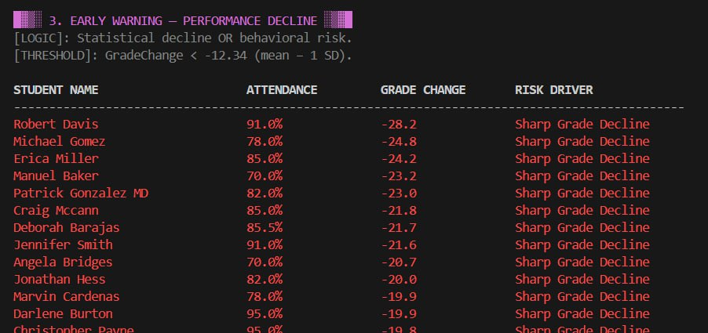

تصویر ۸.۳ -لیست دانش‌آموزان شناسایی‌شده توسط سیستم هشدار زودهنگام

**تحلیل خروجی و منطق حد آستانه:**
1.  **ملاک آماری پایش:** این سیستم با استفاده از پارامترهای آماری جامعه، حد آستانه‌ی بحرانی را معادل **12.34-** نمره (میانگین منهای یک انحراف معیار) تعریف کرده است. هر دانش‌آموزی که افتی بیش از این مقدار داشته باشد، به طور خودکار جهت «حمایت فوری» علامت‌گذاری می‌شود.
2.  **شناسایی ریشه‌های خطر:** همان‌طور که در تصویر ۸.۳ مشهود است، سیستم علاوه بر رصد افت نمره، متغیرهای رفتاری نظیر نرخ حضور (**Attendance**) را نیز تحلیل کرده و علت اصلی ریسک (**Risk Driver**) را برای هر دانش‌آموز تفکیک می‌کند. به عنوان مثال، دانش‌آموزانی نظیر **Robert Davis** با افت شدید **28.2** نمره، به عنوان موارد اولویت‌دار شناسایی شده‌اند.
3.  **جامعیت عملیاتی:** فهرست نمایش داده شده در تصویر ۸.۳ برگزیده‌ای از میان جامعه **1000** نفری دانش‌آموزان است که فرآیند پایش برای تک‌تک آن‌ها به صورت سیستمی اجرا شده است.

**قابلیت پیش‌بینانه (Strategic Value):**
تمایز اصلی این سیستم در عملکرد «هنگامِ سال» آن است؛ به این معنا که سیستم منتظر وقوع شکست نهایی در آزمون‌های پایان سال نمی‌ماند، بلکه با رصد اولین پالس‌های افت نمرات کلاسی و کاهش حضور، ضرورت تشکیل جلسات مشاوره‌ای را به اطلاع مدیران می‌رساند. این مدل، مدیریت آموزشی را از وضعیت «واکنش پس از وقوع» به وضعیت **«مداخله در لحظه»** تغییر داده و شانس بازگشت دانش‌آموزان به روند تحصیلی موفق را به شدت افزایش می‌دهد.

### 8.4 شناسایی و بازپروری استعدادهای نهفته (Hidden Gems)

یکی از نوآورانه‌ترین ابعاد این پژوهش، طراحی ماژول اختصاصی جهت شناسایی دانش‌آموزانی است که در ادبیاتِ پایش آموزشی به آن‌ها «سرمایه‌های نهفته» می‌گوییم؛ افرادی که فراتر از معدل مطلق، نرخ رشد خیره‌کننده‌ای را ثبت کرده‌اند.

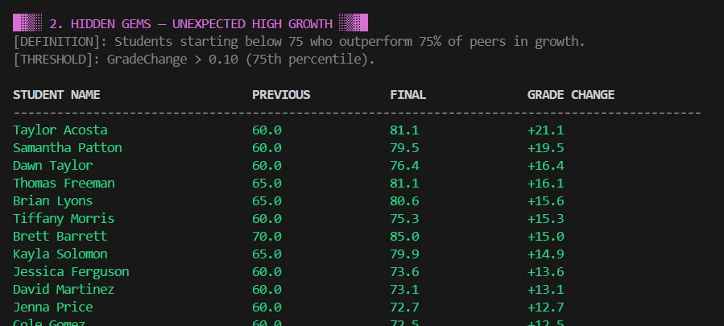

تصویر ۸.۴ - لیست استعدادهای نهفته با نرخ رشد بالا (Hidden Gems)

**تحلیل یافته‌های کلیدی سیستم:**
1.  **معیار گزینش پتانسیل:** سیستم برای شناسایی این گروه، دانش‌آموزانی را فیلتر کرده است که علی‌رغم شروع از سطح نمره زیر ۷۵، نرخ رشد (**GradeChange**) آن‌ها در صدک ۷۵م جامعه (بالاتر از مرز **0.10** طبق خروجی سیستم) قرار داشته است.
2.  **رشدهای جهشی:** همان‌طور که در تصویر ۸.۴ مشاهده می‌شود، دانش‌آموزی نظیر **Taylor Acosta** با وجود نمره اولیه‌ی پایین، موفق به ثبت جهش تحصیلی **21.1+** نمره شده است. همچنین دانش‌آموزانی نظیر **Samantha Patton** با رشد **19.5+** نمره، پتانسیل بالای خود را برای یادگیری سریع به اثبات رسانده‌اند.
3.  **نمونه‌گیری آماری:** این فهرست نمایش‌دهنده‌ی برگزیدگان از کل جامعه **1000** نفری است که به صورت مکانیزه توسط الگوریتم استخراج شده‌اند.

**دلالت‌های استراتژیک (Strategic Insights):**
سیستم‌های آموزشی سنتی به دلیل تمرکزِ صرف بر «معدل کل»، پتانسیل بالای این افراد را نادیده می‌گیرند. یافته‌های این ماژول نشان می‌دهد که این گروه، دارای بالاترین ظرفیتِ «بازگشت سرمایه آموزشی» هستند. تخصیص بورسیه‌های تشویقی و تقدیر از «رشد تحصیلی» (به جای نمره‌ی مطلق) در این گروه، نه تنها انگیزه‌ی درونی آن‌ها را به اوج می‌رساند، بلکه الگویی از امکانِ پیشرفت را برای سایر دانش‌آموزان ضعیف‌تر فراهم کرده و منجر به آزاد شدن ظرفیت‌های عظیم انسانی در محیط آموزشی می‌شود.

### 8.5 استراتژی مداخله هدفمند والدین (Targeted Parental Intervention)

یکی از مهم‌ترین یافته‌های آماری این پژوهش (بخش ۴.۴)، ماهیت «آستانه‌ای» حمایت والدین بود. تحلیل‌ها نشان داد که تغییر وضعیت از حمایت «کم» به «متوسط» هیچ تأثیر معناداری بر نمرات ندارد و جهش تحصیلی تنها در سطح حمایت **«حداکثری» (High)** رخ می‌دهد.

**اقدام اجرایی (The Action):**
بر این اساس، استراتژی مدرسه باید از «آگاهی‌بخشی عمومی» به **«مداخله با شدت بالا»** برای والدینِ دانش‌آموزانِ در معرض خطر (At-Risk) تغییر کند. پروتکل پیشنهادی شامل موارد زیر است:

1.  **گزارش‌دهی میکروسکوپی (Micro-Reporting):** ارسال گزارش عملکرد «هفتگی» (شامل ساعات مطالعه و ریزنمرات) برای والدین این گروه، به جای کارنامه‌های فصلی سنتی. هدف، ایجاد حس نظارت دائمی است.
2.  **قرارداد مشارکت (Partnership Contract):** اخذ تعهد از والدین دانش‌آموزان ضعیف جهت نظارت مستقیم بر «ساعات مطالعه» در منزل (که طبق مدل رگرسیون، قوی‌ترین عامل قابل کنترل است).
3.  **حذف جلسات عمومی:** جایگزینی جلسات اولیا و مربیان کلیشه‌ای با «کارگاه‌های مهارت‌افزایی» مخصوص والدین، جهت آموزش تکنیک‌های ایجاد محیط آرام و نظارت غیرمستقیم.

**هدف استراتژیک:** تبدیل والدین از «ناظران منفعل» به «همیاران آموزشی فعال» در منزل، جهت پر کردن شکافی که مدرسه به تنهایی قادر به رفع آن نیست.

### 8.6 بهینه‌سازی تخصیص منابع بر اساس سیگنال‌های رفتاری

تحلیل داده‌های آماری در بخش نهایی خروجی کد **Action_Plan.py**، بینش‌های ارزشمندی را در مورد ظرفیت‌های رفتاری دانش‌آموزان جهت تخصیص بهینه‌ی منابع بودجه‌ای و زمانی فراهم آورده است.

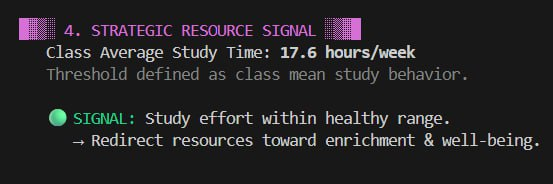

تصویر ۸.۶ - سیگنال استراتژیک تخصیص منابع بر اساس رفتار دانش‌آموزان

**تحلیل شواهد رفتاری (Data Interpretation):**
1.  **شاخص تلاش جمعی:** خروجی تصویر ۸.۶ تایید می‌کند که میانگین ساعات مطالعه‌ی هفتگی در کل جامعه آماری مورد مطالعه برابر با **17.6** ساعت است. 
2.  **تفسیر سیگنال وضعیت:** فعال شدن سیگنال سبز رنگ (**SIGNAL: Healthy range**) نشان‌دهنده آن است که چالش اصلی در این دوره آموزشی، «کمبودِ تلاشِ کمّی» نیست. به بیان دیگر، دانش‌آموزان از نظر صرف زمان برای مطالعه در وضعیت مطلوبی قرار دارند و سیستم در این حوزه به بلوغ رفتاری رسیده است.

**بازتعریف اولویت‌های استراتژیک (Strategic Redirection):**
یافته‌های تصویر ۸.۶، یک چرخشِ سیاستی (Policy Shift) مهم را به مدیران آموزشی گوشزد می‌کند: بودجه و منابع نباید صرفِ «افزایش اجباری ساعات مطالعه» یا کلاس‌های جبرانی عمومی شوند؛ زیرا بازده نهایی آن‌ها نزولی خواهد بود. در مقابل، پیشنهاد می‌شود منابع به سمت **«غنی‌سازی کیفی محیط»** هدایت گردند. اقداماتی نظیر:
*   بهبود زیرساخت‌های فیزیکی (مانند کتابخانه‌های مجهز و فضاهای یادگیری تعاملی).
*   برگزاری کارگاه‌های مدیریت استرس و افزایش تاب‌آوری تحصیلی.
*   تجهیز محیط به ابزارهای آموزش هوشمند.
این تغییر رویکرد از «کمیت» به «کیفیت»، منجر به بهره‌وری بالاتر منابع مالی و جلوگیری از فرسودگی آموزشی دانش‌آموزان خواهد شد.

### 8.7 سنتز نهایی و چرخه بهبود مستمر
در نهایت، برنامه اقدام پیشنهادی یک سیستم ایستا نیست، بلکه یک **«چرخه بازخورد پویا» (Feedback Loop)** است:
1.  **رصد:** (توسط سیستم هشدار).
2.  **مداخله:** (توسط شبکه همتایان و حمایت خانواده).
3.  **تقدیر:** (توسط شناسایی الماس‌های پنهان).

این مدل، مدیریت آموزشی را از یک رویکرد سنتی و شهودی به یک سیستم پیشرفته و **«داده‌محور»** ارتقا می‌دهد که در آن هر تصمیمی با پشتوانه‌ی یک واقعیت آماری اتخاذ می‌شود.

**نکته اجرایی:** راهکارهای ارائه‌شده در این برنامه، مختص به بافت (**Context**) این مجموعه داده خاص هستند. پیاده‌سازی این الگو در سایر مدارس، نیازمند بومی‌سازی آستانه‌ها و پارامترهای مدل بر اساس میانگین نمرات آن جامعه خاص خواهد بود.

 

## 9. فصل نهم: جمع‌بندی کلی و استنتاج نهایی 

Final Synthesis and Conclusion

---

### 9. نگاه جامع به دستاوردهای پژوهش
هدف غایی این مطالعه، گذار از داده‌های خام آموزشی به سمت یک مدل تبیینی و پیش‌بین برای عملکرد تحصیلی بود. در این مسیر، یک پارادایم تحلیلی سه‌رکن شامل **«توصیف»**، **«تبیین»** و **«مداخله»** طراحی گردید. یافته‌های نهایی نشان داد که موفقیت تحصیلی نه یک پدیده تصادفی، بلکه تابعی سیستماتیک از رفتارهای اکتسابی دانش‌آموز و حمایت‌های محیطی است.

### 9.1 پاسخ مبتنی بر داده به سوالات پژوهش
در فصل اول، چهار پرسش کلیدی مطرح گردید. اکنون با اتکا به تحلیل‌های آماری فصول ۴ و ۵، پاسخ‌های قاطع زیر استخراج شده‌اند:

1.  **آیا تفاوت معناداری در عملکرد تحصیلی دختران و پسران وجود دارد و ریشه این تفاوت چیست؟**
    * **نتیجه:** بله، تفاوت معنادار است. دختران به طور میانگین نمرات بالاتری کسب کردند.
    * **ریشه‌یابی:** تحلیل‌های عمیق‌تر (تعامل دوطرفه) نشان داد که این برتری ناشی از تفاوت در استعداد یادگیری نیست (چون شیب پیشرفت برابر بود)، بلکه ناشی از **«آسیب‌پذیری بیشتر پسران»** در محیط‌های با حمایت خانوادگی پایین است.

2.  **آیا برگزاری کلاس‌ها به صورت آنلاین در مقایسه با حضوری، منجر به افت کیفیت یادگیری می‌شود؟**
    * **نتیجه:** خیر، آموزش آنلاین منجر به افت کیفیت نشده است.
    * **تفسیر راهبردی:** نتایج آزمون ANCOVA و T-Test نشان داد که هیچ تفاوت معناداری بین نمرات و نرخ رشد دانش‌آموزان آنلاین و حضوری وجود ندارد. این پدیده تحت عنوان **«هم‌ترازی آموزشی» (Educational Parity)** شناسایی شد که نشان‌دهنده بلوغ زیرساخت‌های دیجیتال مدرسه است.

3.  **حمایت والدین تا چه حد بر نمرات تأثیر دارد و آیا سطوح مختلف حمایتی نتایج متفاوتی ایجاد می‌کنند؟**
    * **نتیجه:** اثرگذاری حمایت والدین خطی نیست، بلکه «آستانه‌ای» است.
    * **جزئیات:** حمایت‌های سطح «متوسط» تفاوت معناداری با سطح «کم» ایجاد نمی‌کنند. جهش تحصیلی تنها زمانی رخ می‌دهد که حمایت والدین به سطح **«حداکثری» (High)** برسد.

4.  **آیا می‌توان با رصد متغیرهای رفتاری در طول سال، نمره نهایی دانش‌آموز را با دقت بالا پیش‌بینی کرد؟**
    * **نتیجه:** بله، با دقت بسیار بالا (۸۰.۲٪).
    * **مدل نهایی:** مشخص شد که می‌توان نمره نهایی را تنها با داشتن سه متغیر **«نمره قبلی»**، **«ساعات مطالعه»** و **«نرخ حضور»** پیش‌بینی کرد. این امر امکان راه‌اندازی «سیستم هشدار زودهنگام» را فراهم ساخت.

### 9.2 منطق مدل‌سازی و پارسیمونی (Parsimony)
یکی از نقاط قوت متدولوژیک این پژوهش، انتخاب **«مدل بهینه و مقرون‌به‌صرفه»** در رگرسیون بود. فرآیند انتخاب متغیرها بر اساس شواهد آماری محکم (مانند P-Value و ماتریس همبستگی) انجام شد:
* **حذف هوشمند:** متغیرهایی نظیر فعالیت فوق‌برنامه به دلیل عدم تاثیر مستقیم و جلوگیری از پیچیدگی غیرضروری مدل (**Overfitting**) کنار گذاشته شدند.
* **ستون‌های پیش‌بین:** سه متغیر نمره قبلی، ساعات مطالعه و نرخ حضور، به عنوان ستون‌های اصلی مدل انتخاب شدند که توازن دقیقی بین روایی علمی و کاربردپذیری اجرایی ایجاد کردند.

### 9.3 ارزش افزوده و توان پیش‌بینی مدل
مدل رگرسیون چندگانه نهایی فراتر از یک فرمول ریاضی، ابزاری برای مدیریت آموزشی فراهم کرد.
* **تبیین واریانس:** مدل توانست بخش بزرگی از نوسانات نمره (بیش از ۸۰٪) را تبیین کند که در علوم رفتاری دقتی ممتاز محسوب می‌شود.
* **قابلیت تشخیص:** این مدل به مدیران اجازه می‌دهد تا با داشتن اطلاعات اولیه، وضعیت دانش‌آموز در پایان سال را تخمین زده و در صورت نیاز، پیش از وقوع افت تحصیلی، مداخلات پیشگیرانه را آغاز کنند.

### 9.4 تضمین کیفیت داده و اعتبار نتایج
تمامی نتایج ارائه شده در این گزارش تحت پروتکل‌های سخت‌گیرانه‌ی کنترل کیفیت قرار گرفتند. فرآیند **Investigation** و اعتبارسنجی داده‌های جایگزین شده (**Imputed Data**) تضمین کرد که بازسازی رکوردهای گمشده، کوچکترین انحرافی در توزیع جامعه ایجاد نکرده است. همچنین رعایت فروض رگرسیون (تست **VIF** و **Durbin-Watson**) اطمینان می‌دهد که نتایج از نظر ریاضی پایدار و قابل تعمیم به جوامع مشابه هستند.

### 9.5 پیامدهای کاربردی برای مدیریت آموزشی
یافته‌های این پژوهش، دلالت‌های اجرایی روشنی را پیشنهاد می‌دهند:
* **تمرکز بر متغیرهای قابل تغییر:** سیاست‌های آموزشی باید به جای تمرکز بر متغیرهای غیرقابل تغییر (مانند جنسیت)، بر تقویت رفتارهای اصلاح‌گر (افزایش ساعات مطالعه و حضور) متمرکز شوند.
* **عدالت در توزیع منابع:** شناسایی «الماس‌های پنهان» گامی بلند به سوی عدالت آموزشی است تا دانش‌آموزانی که سرعت رشد بالایی دارند، در سایه‌ی معدل‌های مطلق پنهان نمانند.

### 9.6 نتیجه‌گیری نهایی
این پروژه تلاشی بود برای پیوند میان «دقت علم آمار» و «هنر آموزش». ما نشان دادیم که تحلیل داده نه تنها وضعیت موجود را به دقت «توصیف» می‌کند، بلکه کلید اصلی برای **«بهبود تجربه یادگیری»** و طراحی سیستم‌های حمایتگر هوشمند است. این گزارش می‌تواند به عنوان یک الگوی عملیاتی برای مدارس و مؤسسات آموزشی مورد استفاده قرار گیرد تا مسیر حرکت خود را بر پایه‌ی **«شواهد آماری»** ترسیم کنند.

 

## 10. منابع و مراجع 

References

---

در انجام این پژوهش، تحلیل‌های آماری و تدوین الگوریتم‌های هوشمند، از منابع علمی معتبر و ابزارهای استاندارد زیر استفاده شده است. شیوه استناددهی در سراسر گزارش بر اساس استاندارد **APA (ویرایش هفتم)** تنظیم گردیده است.

### 10.1 منابع نرم‌افزاری و کتابخانه‌های تحلیل داده
تحلیل‌های محاسباتی و مصورسازی‌ها با استفاده از اکوسیستم پایتون و نرم‌افزار SPSS انجام شده‌اند:

1. IBM Corp. (2023). IBM SPSS Statistics for Windows, Version 27.0. Armonk, NY: IBM Corp.

2. Python Software Foundation. (2024). Python Language Reference, version 3.11. Available at http://www.python.org.

3. Pedregosa, F., et al. (2011). Scikit-learn: Machine Learning in Python. Journal of Machine Learning Research, 12, 2825-2830.

4. Hunter, J. D. (2007). Matplotlib: A 2D graphics environment. Computing in Science & Engineering, 9(3), 90-95.

5. Waskom, M. L. (2021). seaborn: statistical data visualization. Journal of Open Source Software, 6(60), 3021.

### 10.2 منابع روش‌شناسی و آزمون‌های آماری
مبانی نظری آزمون‌های استنباطی (T-Test, ANOVA, Regression) و تفسیر اندازه‌های اثر، بر پایه مراجع زیر استوار است:

6. Field, A. (2018). Discovering Statistics Using IBM SPSS Statistics (5th ed.). London: SAGE Publications.

7. Cohen, J. (1988). Statistical Power Analysis for the Behavioral Sciences (2nd ed.). Hillsdale, NJ: Lawrence Erlbaum Associates.

### 10.3 منبع داده‌ها (Data Source)
داده‌های خام مورد استفاده در این پژوهش از مخزن داده‌های علمی کگل استخراج شده است:

8. Haseeb. (2024). Student Performance Predictions. Kaggle. https://www.kaggle.com/datasets/haseebindata/student-performance-predictions

### 10.4 مستندات و کدهای اختصاصی پروژه
این پژوهش متکی بر ماژول‌های توسعه‌یافته اختصاصی است که پیوست گزارش می‌باشند:

9. **Internal Project Scripts:**
    * Data_Processor.py: الگوریتم‌های پیش‌پردازش، مهندسی ویژگی (GradeChange) و مدیریت داده‌های گمشده.
    * visualizer.py: موتور تولید خودکار نمودارهای اکتشافی، نقشه‌های حرارتی و توزیع‌های آماری.
    * statistical_diagnostics.py: ماژول خودکار برای بررسی شروط VIF و Durbin-Watson.
    * SPSS_Reporter.py: بررسی آزمون‌های SPSS و تصویرسازی نتایح برای درک بهتر
    * Action_Plan.py: موتور هوشمند برای بخش‌بندی دانش‌آموزان و تولید لیست «الماس‌های پنهان».
    * Investigation.py: ماژول اعتبارسنجی و کنترل کیفیت داده‌ها (QC).
